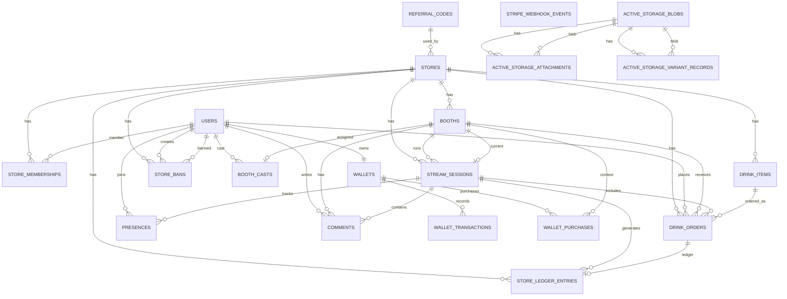

# 基本設計_Phase1

## 0. はじめに

### 0.1 本書の目的

本書は、Butterflyve Phase1（最初のリリース）を成立させるための基本設計を定義するものである。

02_要件定義書で確定した Phase1 の仕様を前提とし、実装時に判断がぶれないよう、データ構造・状態遷移・制約・ユースケース単位の設計方針を整理する。

本書の目的は以下とする。

- Phase1の仕様を技術的に一貫した形で実装可能にする
- 売上整合性を崩さない構造を明確にする
- 将来拡張（Phase2以降）に耐えうる前提を共有する
- 実装・レビュー・テスト時の判断基準を明確にする

### 0.2 対象範囲

本書は Phase1 の機能のみを対象とする。

Phase1では以下を成立させることを目的とする。

- 店舗単位での配信基盤の構築
- ドリンク送信 → 消化 → 売上確定 の一貫した流れ
- 配信終了時の未消化返却
- 1ブース1キャスト制約の保証
- ブースの論理削除（archived_at）による履歴保持
- 店舗→キャスト招待（ワンタイム・24時間）による所属成立

### 0.3 前提条件（Phase1確定事項）

本設計は以下の前提に基づく。

- 売上の定義は「ドリンク消化確定分のみ」とする
- 返却されたドリンクは売上に含めない
- 1ブースにつき1キャストのみ紐づけ可能とする
- ブース紐づけは確定後変更不可とする
- キャスト変更が必要な場合は新規ブースを作成する
- ブースは物理削除せず、archived_at による論理削除を採用する
- キャスト所属は店舗→招待→本人承認（ワンタイム・24時間）を必須とする
- Phase1では所属解除機能は実装しない

### 0.4 非対象（Phase2以降）

以下は Phase1 の対象外とする。

- 全国／エリア／ジャンルランキング
- イベントランキング（リアルタイム集計）
- 複数キャスト同時運用
- ブース紐づけ変更機能
- 所属解除（退店／退会）

これらは Phase2 以降で検討・実装する。

---

## 1. 用語・略語

### 1.1 ドメイン用語

本プロダクトにおける主要な用語を以下に定義する。

#### Store（店舗）
配信および売上の管理主体。
ブース、ドリンクメニュー、売上台帳、キャスト所属などは店舗単位で管理される。

#### Booth（ブース）
店舗内の配信ルーム。
配信・売上・履歴の単位であり、Phase1では実質的に「特定キャストに紐づく配信ルーム」として扱う。

- 1ブースにつき1キャスト（Phase1制約）
- 紐づけ確定後の変更不可
- archived_at により論理削除（アーカイブ）される

#### Cast（キャスト）
配信を行うユーザー。
user.role = cast により識別される。

- 店舗からの招待を承認することで所属が成立する
- 複数店舗に所属することは可能
- 複数ブースを持つことが可能（店舗横断を含む）

#### Customer（顧客）
配信を視聴し、コメント・ドリンク送信を行うユーザー。
user.role = customer により識別される。

#### Store Admin（店舗管理者）
店舗に所属し、ブース管理・キャスト招待・売上確認などを行うユーザー。
store_memberships により店舗と紐づく。

#### StreamSession（配信セッション）
配信の開始から終了までの単位。
配信中の視聴・コメント・ドリンク注文はこの単位に紐づく。

#### DrinkItem（ドリンクメニュー）
店舗が定義するポイント商品。
価格は price_points で表現される。

#### DrinkOrder（ドリンク注文）
顧客が送信したドリンクの記録。
未消化／消化確定／返却の状態を持つ。

#### StoreLedgerEntry（店舗売上台帳）
消化確定したドリンクを売上として記録する台帳。
drink_order_id に対して一意に作成される。

#### Wallet（ウォレット）
顧客のポイント残高。
available_points と reserved_points を保持する。

#### WalletTransaction（ポイント台帳）
ポイントの増減履歴。
購入・予約・消化・返却などのイベントを記録する。

#### Presence（在室情報）
顧客が配信セッションに入室している状態を表す記録。

### 1.2 売上の定義（Phase1）

Phase1における売上は以下の通り定義する。

- 売上 = ドリンクの「消化確定分」の合計
- 未消化のドリンクは売上に含めない
- 返却されたドリンクは売上に含めない
- 売上表示および集計は、原則として store_ledger_entries を正とする

### 1.3 Phase1制約（設計上の前提）

本設計では以下を前提とする。

1. 1ブース1キャストとする
2. ブース紐づけは確定後変更不可とする
3. ブースは物理削除せず、archived_at により論理削除する
4. キャスト所属は「店舗→招待→本人承認（ワンタイム・24時間）」を必須とする
5. Phase1では所属解除（退店／退会）は実装しない

これらの制約は、売上整合性および履歴保持を最優先とする設計思想に基づく。

---

## 2. 役割・権限設計

### 2.1 ユーザー種別

本システムでは、users.role により以下のロールを定義する。

- customer（顧客）
- cast（キャスト）
- store_admin（店舗管理者）
- system_admin（システム管理者）

ロールは認証・画面表示・操作可否の制御に使用する。

---

### 2.2 店舗所属（store_memberships）

店舗との関係は store_memberships テーブルにより管理する。

- store_id
- user_id
- membership_role

店舗管理者は store_memberships を通じて店舗に所属する。
キャストも店舗に所属するが、所属成立は必ず本人承認を経る（Phase1: MUST）。

#### 所属成立フロー（Phase1）

1. 店舗管理者が招待を発行する
2. 招待はワンタイムURL（またはQR）
3. 有効期限は24時間
4. キャスト本人がログイン状態で承認した場合のみ所属成立

Phase1では、以下は提供しない。

- キャストからの店舗申請機能
- 所属解除機能（退店／退会）

### 2.3 操作権限マトリクス（概要）

#### 2.3.1 Customer（顧客）

- 配信の視聴
- 在室（Presence）
- コメント投稿
- ポイント購入
- ドリンク送信
- 自身のポイント残高確認

以下は不可。

- 配信開始／終了
- ブース管理
- キャスト管理
- 売上閲覧（店舗全体）

#### 2.3.2 Cast（キャスト）

- 自身が紐づくブースでの配信開始
- 席外し／復帰
- 配信終了
- ドリンク消化（売上確定）
- コメント閲覧

以下は不可。

- 他キャストの管理
- 店舗売上全体の閲覧（店舗管理者機能）
- ブース削除（アーカイブ操作）

#### 2.3.3 Store Admin（店舗管理者）

- ブース作成
- ブースアーカイブ（archived_at 設定）
- キャスト招待発行
- ブースへのキャスト紐づけ（※確定後変更不可）
- 店舗売上閲覧
- キャスト別売上閲覧
- ドリンクメニュー管理
- 顧客BAN

以下は不可。

- システム全体設定の変更

#### 2.3.4 System Admin（システム管理者）

- 全店舗の管理
- ユーザー管理
- システム設定変更
- 障害対応・運用操作

### 2.4 権限設計の基本方針

1. 売上整合性を最優先とする  
2. ブース紐づけ変更不可により、過去履歴の整合性を保証する  
3. 所属は本人承認必須とし、なりすましを防止する  
4. Phase1では「安全側」に倒す（解除・差し替え機能は持たない）  

権限はコントローラレベルおよびポリシー（必要に応じて）で制御する。

---

## 3. 全体アーキテクチャ概要（Phase1）

### 3.1 構成概要

Phase1におけるシステム構成は以下の通りとする。

- フロントエンド：Rails + Hotwire（Turbo）
- バックエンド：Rails（API兼用）
- 配信基盤：Amazon IVS Real-Time（Stage）
- 決済基盤：Stripe（Checkout + Webhook）
- データベース：PostgreSQL
- リアルタイム更新：Turbo Streams（必要箇所のみ）

配信・売上・ポイント管理を単一Railsアプリ内で統合管理する。

### 3.2 責務分離の考え方

#### 3.2.1 配信と売上の分離

- 映像配信は Amazon IVS Real-Time に委譲する
- 売上・ドリンク・ポイント管理はアプリケーション側で完結させる

配信の可否と売上確定は論理的に分離される。
配信が存在しても、ドリンクが消化されなければ売上は発生しない。

#### 3.2.2 セッション単位の責務

StreamSession は以下の責務を持つ。

- 配信期間の管理（started_at / ended_at）
- 在室（Presence）の管理単位
- コメントの紐づけ単位
- ドリンク注文の紐づけ単位
- 売上台帳（store_ledger_entries）の紐づけ単位

ブースは恒久的な概念であり、
StreamSession は時間的な単位である。

### 3.3 リアルタイム更新方針

Phase1では必要最小限のリアルタイム性のみを実装する。

- コメント表示：Turbo Streams
- 在室人数更新：定期ポーリング（Presence）
- ドリンク送信／消化反映：即時画面更新

ランキングのリアルタイム更新は Phase1では対象外とする。

### 3.4 配信フロー（概要）

1. キャストがブースで配信開始
2. StreamSession が生成される
3. IVS Stage に join / publish
4. 顧客が視聴参加（Presence生成）
5. 顧客がドリンク送信
6. キャストが消化
7. StoreLedgerEntry が作成され売上確定
8. 配信終了
9. 未消化ドリンクを自動返却

### 3.5 売上整合性の設計思想

売上整合性は以下で担保する。

- 消化確定時にのみ売上台帳（store_ledger_entries）を生成
- drink_order_id を unique 制約とし二重計上を防止
- 返却は売上に含めない
- Wallet は available / reserved を明確に分離

売上の「正」は store_ledger_entries とする。

### 3.6 Phase1における安全設計

Phase1では以下の安全側設計を採用する。

- ブース紐づけ変更不可
- 所属解除機能なし
- 物理削除なし（archived_at による論理削除）
- 台帳ベースの売上確定

これにより、履歴整合性と売上の一貫性を最優先で保証する。

---

## 4. データ設計

### 4.1 設計方針

Phase1のデータ設計は、以下の原則に基づく。

1. 売上整合性を最優先とする
2. 履歴は物理削除せず保持する
3. 将来拡張（Phase2）を妨げない構造にする
4. 冪等性と二重計上防止を明示的に保証する

売上の正は store_ledger_entries とし、
ドリンク消化確定時にのみ売上が計上される構造とする。

### 4.2 ER図（Phase1）

以下は Phase1 の主要エンティティ関係図である。

* ※ `active_storage_*` は Rails 標準の添付機構（ドメイン外）であり、ER図には参考として掲載している。
* ※ `stripe_webhook_events` は Stripe Webhook 受信ログ（外部連携ログ）で、業務ドメインの正規データは別テーブル（wallet_purchases / wallet_transactions 等）に保持する。

### 4.3 主要テーブルと役割（Phase1抜粋）

#### stores

店舗（売上・配信の管理主体）。

* `name`（必須）
* `referral_code_id`（店舗登録で使用した紹介コード、FK。登録フローでは必須扱い）

#### users

ユーザー（customer / cast / store_admin 等）。

* `role`（必須・indexあり）
* `email`（必須・unique）

#### store_memberships

ユーザーの店舗所属（店舗管理者などの権限付与）。

* `store_id` / `user_id` / `membership_role`（必須）
* `store_id, user_id, membership_role` に **unique**（同一ロールの二重所属防止）

#### booths

配信ルーム（店舗内の配信・売上・履歴の単位）。

* `store_id`（必須）
* `status`（必須・default: 0）
* `archived_at`（NULL=現役 / NOT NULL=アーカイブ、indexあり）
* `current_stream_session_id`（現在の配信を参照、FKあり）
* `ivs_stage_arn`（IVS Stage ARN、indexあり）

#### booth_casts

ブースとキャストの紐づけ（Phase1では実質 1ブース=1キャスト運用）。

* `booth_id` / `cast_user_id`（必須）
* `booth_id, cast_user_id` に **unique**（同一ペアの重複作成防止）
* **注意**：DB制約として「booth_id 単体の unique」は無いため、  
  “1ブース1キャスト” は **アプリケーション側（UI/モデル）で保証**する（将来、DB制約追加の余地あり）。

#### stream_sessions

配信セッション（開始〜終了の単位）。視聴・コメント・注文の紐づけ先。

* `store_id` / `booth_id`（必須）
* `started_at`（必須） / `ended_at`（任意・indexあり）
* `status`（必須）
* `started_by_cast_user_id`（必須）
* `ivs_stage_arn`（任意・indexあり）

#### presences

在室情報（視聴者の入室〜退出／最終ping）。

* `stream_session_id` / `customer_user_id`（必須）
* `joined_at`（必須）
* `last_seen_at`（必須・indexあり）
* `left_at`（任意・indexあり）
* `stream_session_id, customer_user_id, joined_at` に **unique**

#### comments

コメント（配信セッション単位で蓄積、論理削除あり）。

* `stream_session_id` / `booth_id` / `user_id`（必須）
* `body`（必須）
* `deleted_at`（任意・論理削除）
* `stream_session_id, created_at` / `booth_id, created_at` の index（時系列表示を想定）

#### drink_items

ドリンクメニュー（店舗が定義するポイント商品）。

* `store_id`（必須）
* `name`（必須）
* `price_points`（必須、**DB制約: `price_points > 0`**）
* `enabled`（必須・default: true）
* `position`（必須・default: 0）
* `store_id, enabled, position` の index（表示用）

#### drink_orders

ドリンク注文（顧客→配信への送信イベント）。

* `store_id` / `booth_id` / `stream_session_id`（必須）
* `customer_user_id`（必須） / `drink_item_id`（必須）
* `status`（必須）
* `consumed_at`（消化確定） / `refunded_at`（返却、いずれも任意）
* `idx_drink_orders_fifo`（`stream_session_id, status, created_at, id`）を持ち、FIFO処理をDB indexで支える

#### store_ledger_entries

店舗売上台帳（売上の正）。**消化確定時のみ**作成される。

* `store_id` / `stream_session_id`（必須）
* `drink_order_id`（必須、**unique**：二重計上防止）
* `occurred_at`（必須、`store_id, occurred_at` に index）
* `points`（必須、**DB制約: `points > 0`**）

#### store_bans

店舗BAN（店舗ごとの顧客利用制限）。

* `store_id` / `customer_user_id` / `created_by_store_admin_user_id`（必須）
* `store_id, customer_user_id` に **unique**（同一店舗での重複BAN防止）

#### wallets

顧客のポイント残高（1 customer = 1 wallet）。

* `customer_user_id`（必須、**unique**）
* `available_points`（必須・default: 0、**DB制約: `>= 0`**）
* `reserved_points`（必須・default: 0、**DB制約: `>= 0`**）

#### wallet_transactions

ポイント台帳（増減イベント履歴）。参照元を多態で保持する。

* `wallet_id`（必須）
* `kind`（必須）
* `occurred_at`（必須、`wallet_id, occurred_at desc` に index）
* `ref_type` / `ref_id`（任意、indexあり）

#### wallet_purchases

ポイント購入（Stripe決済）イベント。

* `wallet_id`（必須）
* `points`（必須）
* `status`（必須・default: 0）
* `paid_at` / `credited_at`（任意）
* `stripe_checkout_session_id`（任意・unique）
* `booth_id`（任意）

#### referral_codes

店舗登録の入口制御・流入計測のための「許可リスト」（共通コード）。

* `code`（必須・unique）
* `label`（任意：運用上の識別）
* `enabled`（必須・default: true）
* `expires_at`（任意：期限）

#### stripe_webhook_events

Stripe Webhook 受信ログ（冪等性・検証用）。

* `event_id`（必須・unique）
* `event_type`（必須）
* `received_at`（必須）
* `payload`（jsonb）

#### （注記）ActiveStorage 系

`active_storage_blobs / active_storage_attachments / active_storage_variant_records` は Rails 標準機構（ファイル添付）として存在する

### 4.4 ブースアーカイブ設計（archived_at）

booths テーブルに archived_at を追加する。

* archived_at が NULL → 現役
* archived_at が NOT NULL → アーカイブ

アーカイブされたブースは：

* 顧客向け一覧から除外
* 管理画面ではデフォルト非表示
* 配信開始不可
* 売上履歴は保持

物理削除は行わない。

### 4.5 売上確定のデータフロー

1. 顧客がドリンク送信 → drink_orders 作成（未確定）
2. キャストが消化 → consumed_at 設定
3. store_ledger_entries 作成（drink_order_id unique）
4. WalletTransaction によりポイント移動を確定

売上は store_ledger_entries を基準に集計する。

### 4.6 将来拡張の余地（Phase2への布石）

Phase2以降で以下の拡張を想定する。

* drink_orders.cast_user_id の追加
* キャスト売上台帳の導入
* 複数キャスト運用
* ランキング（日次／イベント）

Phase1ではこれらを実装しないが、
拡張可能な構造を維持する。

---

## 5. 状態遷移設計

本章では、Phase1における主要エンティティの状態遷移を定義する。

対象は以下とする。

- Booth
- StreamSession
- DrinkOrder

### 5.1 Booth 状態遷移（booths.status）

Booth は「配信可能なルームの状態」を表す。
論理削除（archived_at）は別軸で管理する。

#### 状態（例）

- offline（待機）
- live（配信中）
- away（席外し）

#### 状態遷移

offline → live  
live → away  
away → live  
live → offline  

#### 補足

- archived_at が NOT NULL の Booth は、いかなる場合も live へ遷移不可
- 配信開始時に StreamSession を生成し、current_stream_session_id を設定する
- 配信終了時に current_stream_session_id を NULL に戻す

Booth の status は「UI上の表示状態」であり、売上計算には直接関与しない。

### 5.2 StreamSession 状態遷移（stream_sessions.status）

StreamSession は配信期間を表す。

#### 状態（例）

- standby（準備）
- live（配信中）
- ended（終了）

#### 状態遷移

standby → live  
live → ended  

Phase1では再開（ended → live）は行わない。
再開が必要な場合は新しい StreamSession を生成する。

#### 終了時処理（重要）

StreamSession が ended に遷移する際、以下を必ず実行する。

- 未消化の DrinkOrder を返却する
- Booth.status を offline に戻す
- Booth.current_stream_session_id を NULL にする

### 5.3 DrinkOrder 状態遷移（drink_orders.status）

DrinkOrder は売上整合性の核となる。

#### 状態（概念）

- pending（未消化）
- consumed（消化確定）
- refunded（返却）

※実際の status enum 名は実装に準ずる。

#### 遷移フロー

pending → consumed  
pending → refunded  

consumed → refunded は Phase1では行わない（消化確定は不可逆）。

#### 売上との関係

- consumed になった時点で store_ledger_entries を生成する
- refunded は売上に含めない
- store_ledger_entries.drink_order_id は unique 制約で二重計上を防止する

### 5.4 売上確定タイミング

売上確定は以下の瞬間とする。

- キャストがドリンクを「消化」した時

この時点で：

1. drink_orders.consumed_at を設定
2. store_ledger_entries を生成
3. WalletTransaction を確定側に反映

この処理は原子的に扱う（トランザクション内で実行）。

### 5.5 返却処理（配信終了時）

StreamSession 終了時に：

- pending 状態の DrinkOrder を抽出
- refunded に遷移させる
- WalletTransaction によりポイントを返却
- store_ledger_entries は生成しない

これにより、売上は消化確定分のみになる。

### 5.6 不変条件（Phase1保証事項）

以下は Phase1 の不変条件とする。

- 売上は消化確定分のみである
- store_ledger_entries は drink_order_id に対して一意
- archived_at が設定された Booth は配信不可
- ブース紐づけは確定後変更不可
- 返却された注文は売上に含めない

これらを破る変更は、Phase1では許容しない。

---

## 6. 機能設計（ユースケース別）

本章では、Phase1で提供する機能をユースケース単位で定義する。
各機能は 02_要件定義書の Phase1 確定仕様を前提とし、売上整合性と履歴保持を最優先とする。

### 6.1 店舗：ブース作成／一覧／アーカイブ

#### 目的
店舗が配信ルーム（ブース）を管理し、キャスト変更等の運用を「新規ブース作成＋旧ブースアーカイブ」で安全に行えるようにする。

#### 入出力（概要）
- 入力：ブース名、説明（任意）
- 出力：ブース一覧（現役のみ／アーカイブ含む切替）

#### 仕様
- ブース一覧はデフォルトで「現役（archived_at IS NULL）」のみ表示する
- 「アーカイブ表示」切替で archived_at NOT NULL も閲覧可能とする
- ブース作成により `booths` レコードが生成される
- ブースのアーカイブは `booths.archived_at = Time.current` を設定する
- アーカイブ済みブースは顧客向け導線から非表示とする

#### 禁止事項（Phase1）
- ブースの物理削除は行わない
- アーカイブ済みブースの復帰（unarchive）はPhase1では必須としない（必要なら別途要件化する）

### 6.2 店舗：キャスト所属（招待→承認）※MUST

#### 目的
店舗がキャストを安全に所属させる（勝手な所属を防ぐ）。Phase1では店舗→キャスト招待のみを提供する。

#### 仕様（Phase1）
- 店舗管理者が招待を発行できる
- 招待はワンタイムで、24時間で失効する（MUST）
- キャスト本人がログイン状態で招待URLにアクセスし、明示的に承認した場合のみ所属成立
- キャスト→店舗の所属申請は提供しない

#### 例外と扱い
- 誤招待／誤承認が発生しても、ブースに紐づけない限り配信・売上に影響はない
- 所属解除はPhase1では提供しない（Phase2以降）

### 6.3 店舗：ブースへのキャスト紐づけ（確定後変更不可）

#### 目的
ブースを「特定キャストの配信ルーム」として確定し、売上帰属の整合性を守る。

#### 仕様（Phase1）
- 店舗管理者は、ブースにキャストを紐づけできる
- 紐づけは `booth_casts` を作成して表現する
- 1ブースに紐づけ可能なキャストは1名のみ（UI＋モデルで保証）
- 紐づけ確定後の変更（解除・差し替え）は不可（Phase1）
- キャスト変更が必要な場合は、新規ブース作成＋旧ブースアーカイブで対応する

#### 事前条件
- 対象キャストが当該店舗に所属済み（招待承認済み）であること

#### 禁止事項
- 既存 booth_casts を削除して再作成する運用は行わない

### 6.4 キャスト：配信開始／席外し／復帰／配信終了

#### 目的
キャストがブースで配信を行い、顧客が視聴できる状態を成立させる。

#### 仕様（Phase1）
- 配信開始時に StreamSession を生成する
  - stream_sessions.started_at を設定
  - stream_sessions.status を live（相当）へ遷移
  - booths.current_stream_session_id を設定
  - booths.status を live（相当）へ遷移
- 席外し／復帰は booths.status を away/live（相当）へ遷移させる
- 配信終了時に stream_sessions.ended_at を設定し、status を ended（相当）へ遷移させる
- 終了処理で booths.current_stream_session_id を NULL に戻し、booths.status を offline（相当）へ遷移させる
- アーカイブ済みブースは配信開始不可

### 6.5 視聴：入室／在室（Presence）／退室

#### 目的
視聴者数の把握と、配信中の参加状況を維持する。

#### 仕様（Phase1）
- 顧客が視聴ページを開くと Presence を作成または更新する
- last_seen_at を定期的に更新する（ポーリング）
- 一定時間 last_seen_at 更新がない場合、left_at を設定し退室扱いにする

#### 禁止事項
- Presence は売上計算に関与しない

### 6.6 視聴：コメント投稿／表示／削除（論理削除）

#### 目的
配信中コミュニケーションを成立させる。

#### 仕様（Phase1）
- コメントは stream_session 単位で表示する
- 投稿は Turbo Streams により即時反映する
- 削除は論理削除（comments.deleted_at）で行う
- アーカイブ済みブースの過去セッションコメントは閲覧可能（履歴保持）

### 6.7 視聴：ポイント購入（Stripe）

#### 目的
顧客がポイントを購入し、ドリンク送信に利用できるようにする。

#### 仕様（Phase1）
- Checkout により支払いを行う
- Webhook を受信し、支払い成功を確定する
- wallet_purchases に購入記録を保存する
- wallet_transactions によりウォレットへ反映する
- stripe_webhook_events に受信ログを保存し冪等性を担保する

### 6.8 視聴：ドリンク送信

#### 目的
顧客が配信中に店舗売上へ貢献できるようにする。

#### 仕様（Phase1）
- drink_orders を作成する（status = pending 相当）
- 送信時点では売上確定しない
- 送信時点でポイントは reserved（予約）へ移す（reserved_points）
- 送信は stream_session に紐づける
- 店舗BANされている顧客は送信不可

### 6.9 キャスト：ドリンク消化（売上確定）

#### 目的
夜の店文化における「消化＝売上確定」をシステム上で成立させる。

#### 仕様（Phase1）
- 対象の drink_order を consumed に遷移させる
  - consumed_at を設定
- 売上台帳 store_ledger_entries を作成する
  - drink_order_id を unique にし二重計上を防止する
- ポイントを reserved → 確定（available減＋reserved減等、実装方式に準ずる）へ反映する
- この一連はトランザクションで実行し原子性を担保する

#### 禁止事項
- consumed を refunded に戻す（消化確定の取り消し）は Phase1では行わない

### 6.10 配信終了時：未消化返却（売上除外）

#### 目的
配信終了時に未消化ドリンクを返却し、売上を「消化確定分のみ」に保つ。

#### 仕様（Phase1）
- stream_session 終了処理で pending の drink_orders を抽出する
- refunded_at を設定し refunded に遷移させる
- reserved ポイントを返却する
- 返却分について store_ledger_entries は作成しない

### 6.11 店舗：顧客BAN（入室・コメント・送信制限）

#### 目的
店舗の安全運用のため、問題ユーザーを店舗単位で制限できるようにする。

#### 仕様（Phase1）
- store_bans により customer を店舗単位でBANできる
- BANされた顧客は、対象店舗の視聴／コメント／ドリンク送信を制限する
- BANは店舗ごとに独立する（他店舗へは影響しない）

---

## 7. 集計・表示設計（Phase1）

本章では、Phase1における売上および関連情報の表示・集計方法を定義する。
売上整合性を最優先とし、「消化確定分のみ」を一貫して扱う。

### 7.1 売上の正（Single Source of Truth）

Phase1における売上の正は `store_ledger_entries` とする。

- 売上 = store_ledger_entries.points の合計
- 集計基準日時 = store_ledger_entries.occurred_at
- drink_order_id は unique 制約により二重計上を防止

直接 drink_orders を集計基準にしない理由：

- 消化確定時のみ台帳が作成されるため冪等性が保証される
- 返却や例外処理の影響を受けにくい
- 将来の拡張（台帳拡張）に耐えられる

### 7.2 店舗売上の集計

#### 集計単位
- 店舗単位（store_id）

#### 集計方法
- store_ledger_entries
  - where store_id = ?
  - occurred_at を期間指定
  - sum(points)

#### 表示例（管理画面）
- 本日売上
- 今月売上
- 配信セッション単位売上
- ブース単位売上

#### 除外条件
- 返却分は台帳に記録されないため自動的に除外される
- 未消化注文は売上に含めない

### 7.3 キャスト売上の集計（Phase1）

Phase1では drink_orders に cast_user_id を持たないため、
キャスト売上は以下の方法で算出する。

#### 集計ロジック

1. booth_casts から対象 cast_user_id に紐づく booth_id を取得
2. 対象 booth_id に紐づく store_ledger_entries を取得
3. points を合算

#### 特徴

- 店舗横断で集計する
- キャストは複数ブースを持つことができる前提
- 旧ブース（archived_at 設定済み）も履歴として含める

#### 除外条件

- アーカイブは表示制御であり、売上履歴には影響しない
- 返却分は含めない

### 7.4 未消化・返却の表示ルール

#### 未消化（pending）

- 売上に含めない
- 管理画面・キャスト画面で「未消化」として表示する
- 配信終了時に自動返却対象となる

#### 返却（refunded）

- 売上に含めない
- 履歴として参照可能
- 返却日時（refunded_at）を表示可能とする

### 7.5 ブース一覧表示ルール

#### 顧客向け

- archived_at IS NULL のみ表示
- archived_at NOT NULL は非表示

#### 店舗管理画面

- デフォルト：archived_at IS NULL
- 「アーカイブ表示」切替で archived_at NOT NULL も表示
- アーカイブ済みブースは配信開始不可

### 7.6 セッション単位表示

StreamSessionごとに以下を表示可能とする。

- 配信開始日時／終了日時
- セッション売上（store_ledger_entries 集計）
- 消化済みドリンク数
- 未消化ドリンク数
- 返却ドリンク数

### 7.7 Phase1における非対応

以下は Phase1では実装しない。

- 全国ランキング
- エリア別ランキング
- ジャンル別ランキング
- イベントランキング（リアルタイム更新）
- 店舗対決機能

これらは Phase2 以降で設計・実装する。

### 7.8 不変条件（集計観点）

Phase1において、以下を常に満たす。

- 売上は消化確定分のみである
- 返却分は売上に含めない
- 売上台帳は二重計上されない
- アーカイブは表示制御であり、履歴や集計に影響しない

---

## 8. 非機能要件（Phase1）

本章では、Phase1において保証すべき非機能要件を定義する。
特に売上整合性・冪等性・排他制御を重視する。

### 8.1 売上整合性

#### 8.1.1 二重計上防止

- store_ledger_entries.drink_order_id は unique 制約とする
- 同一 drink_order に対し複数の売上台帳を作成できない

これにより、二重消化・多重リクエストによる売上重複を防止する。

#### 8.1.2 売上確定の一貫性

売上確定（消化）は以下をトランザクション内で実行する。

1. drink_orders.consumed_at を設定
2. store_ledger_entries を生成
3. WalletTransaction を確定反映

途中で失敗した場合はロールバックする。

### 8.2 ポイント整合性（Wallet）

#### 8.2.1 マイナス禁止

- wallets.available_points >= 0
- wallets.reserved_points >= 0

DB check constraint により保証する。

#### 8.2.2 予約と確定の分離

- ドリンク送信時：available → reserved へ移動
- 消化時：reserved → 確定（売上）へ反映
- 返却時：reserved → available へ戻す

これにより、未消化分が売上に混入することを防止する。

### 8.3 排他制御

#### 8.3.1 ドリンク消化の排他

- 同一 drink_order の同時消化を防止する
- モデルレベルで状態チェックを行う
- 必要に応じて with_lock を使用する

#### 8.3.2 Wallet 更新の排他

- Wallet 更新は with_lock で実行する
- available / reserved の整合性を常に保証する

### 8.4 アーカイブ整合性

- archived_at が設定された Booth は配信開始不可
- archived_at は物理削除ではないため、履歴参照は可能
- 集計は archived_at の有無に影響されない

### 8.5 パフォーマンス

#### 8.5.1 売上集計

- store_ledger_entries に store_id + occurred_at index を持つ
- 日次・月次集計はインデックス前提で設計する

#### 8.5.2 FIFO消化

- drink_orders に stream_session_id + status + created_at + id の複合インデックスを持つ
- FIFO順に未消化を取得可能とする

### 8.6 冪等性

#### 8.6.1 Stripe Webhook

- stripe_webhook_events.event_id を unique とする
- 同一Webhookの再送に対し二重処理を行わない

#### 8.6.2 売上生成

- store_ledger_entries.drink_order_id unique により二重作成を防止

### 8.7 ログ・監査

以下を監査可能とする。

- 誰が配信を開始／終了したか
- どのドリンクがいつ消化されたか
- 売上台帳の生成時刻
- Webhook受信履歴

将来のトラブル対応・問い合わせ対応を想定し、
履歴を保持する。

### 8.8 安全側設計（Phase1）

Phase1では以下を採用する。

- 紐づけ変更不可
- 所属解除なし
- 物理削除なし
- ランキング未実装
- 売上台帳ベースの集計

柔軟性よりも整合性を優先する。

---

## 9. テスト観点（Phase1）

本章では、Phase1において保証すべきシナリオおよび回帰観点を整理する。
特に売上整合性と状態遷移の破綻が起きないことを重視する。

### 9.1 正常系シナリオ

#### 9.1.1 配信開始〜終了

1. キャストがブースで配信開始できる
2. StreamSession が生成される
3. Booth.status が live になる
4. 配信終了時に StreamSession が ended になる
5. Booth.status が offline に戻る
6. Booth.current_stream_session_id が NULL になる

#### 9.1.2 ドリンク送信〜消化〜売上確定

1. 顧客がドリンク送信できる
2. Wallet.available → reserved に移動する
3. キャストがドリンクを消化できる
4. consumed_at が設定される
5. store_ledger_entries が1件生成される
6. WalletTransaction が確定処理される
7. 店舗売上に反映される

#### 9.1.3 配信終了時の未消化返却

1. 未消化の drink_order が存在する状態で配信終了
2. pending → refunded に遷移する
3. Wallet.reserved → available に戻る
4. store_ledger_entries は生成されない
5. 売上に含まれない

#### 9.1.4 ブースアーカイブ

1. ブースをアーカイブできる（archived_at 設定）
2. 顧客向け一覧から非表示になる
3. 配信開始できない
4. 売上履歴は参照可能

### 9.2 権限テスト

#### 9.2.1 顧客

- 他店舗の管理画面にアクセスできない
- ドリンク送信はBANされている店舗では不可

#### 9.2.2 キャスト

- 紐づいていないブースでは配信開始不可
- 他キャストのブースでは配信開始不可

#### 9.2.3 店舗管理者

- 自店舗のブースのみ管理可能
- 他店舗の売上閲覧不可

### 9.3 異常系

#### 9.3.1 二重消化防止

- 同一 drink_order に対して同時に消化操作を行った場合でも、
  store_ledger_entries は1件のみ生成される

#### 9.3.2 二重Webhook

- 同一 Stripe event_id を再送しても、
  wallet_purchases / wallet_transactions が重複しない

#### 9.3.3 不正状態遷移

- consumed → refunded へは遷移できない
- archived ブースは live へ遷移できない

### 9.4 データ整合性確認

- store_ledger_entries.drink_order_id は一意である
- wallets.available_points / reserved_points が負にならない
- 未消化は売上に含まれていない
- 返却は売上に含まれていない

### 9.5 回帰（デグレ）観点

- スタンバイ／配信状態変更でプレビューが消えない
- 返却処理変更により売上が誤計上されない
- ブース紐づけロジック変更で過去売上が壊れない
- アーカイブ処理追加により配信開始制御が崩れない

### 9.6 Phase1完了判定基準

以下を満たした場合、Phase1は成立と判断する。

- 売上が「消化確定分のみ」で安定して算出できる
- 未消化返却が確実に動作する
- 二重計上が発生しない
- ブース紐づけ変更ができないことが保証されている
- アーカイブが安全に動作する
- 所属が本人承認必須である

売上整合性が壊れないことを最優先の完了条件とする。

