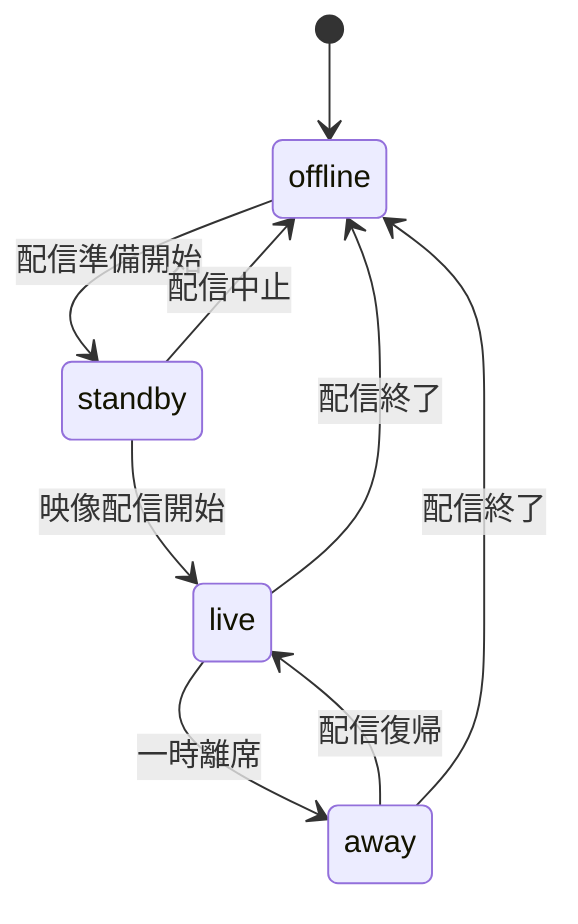
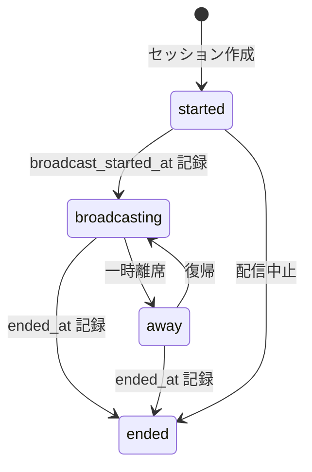
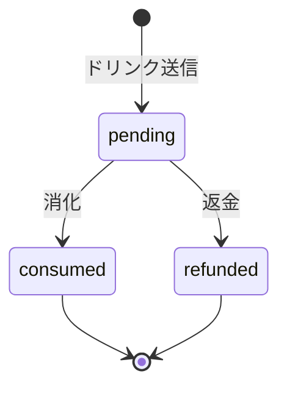
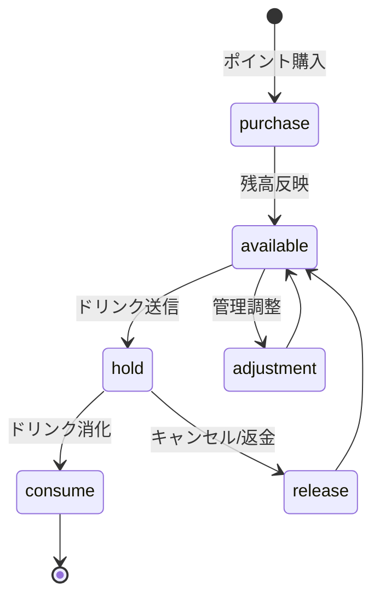
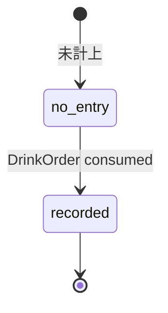
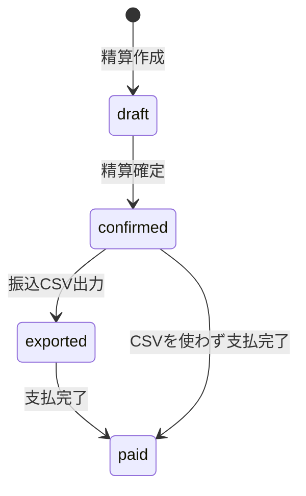
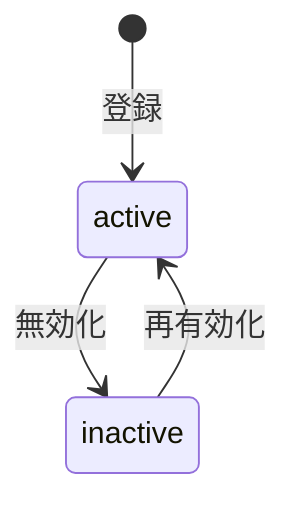

# State Transitions（状態遷移設計）

## 1. 概要

本ドキュメントは、Butterflyve の主要な状態遷移を整理する。

対象は以下とする。

* Booth
* StreamSession
* DrinkOrder
* WalletTransaction
* Settlement

---

## 2. Booth 状態

### 2.1 状態一覧

```text
offline / standby / live / away
```

### 2.2 状態遷移



### 2.3 補足

* Booth は視聴者向け表示状態として扱う
* 実際の配信セッションは StreamSession が保持する
* Booth.status と StreamSession.status の同期ルールは明文化が必要

---

## 3. StreamSession 状態

### 3.1 主な日時

```text
started_at
broadcast_started_at
ended_at
```

### 3.2 状態遷移



### 3.3 補足

* started_at は配信枠開始を表す
* broadcast_started_at は実際の映像配信開始を表す
* ended_at が入った時点で終了済みとみなす

---

## 4. DrinkOrder 状態

### 4.1 状態一覧

```text
pending / consumed / refunded
```

### 4.2 状態遷移



### 4.3 ドメインルール

* pending は注文作成済み・未消化状態
* consumed になった時点で店舗売上が確定する
* refunded は返金済み状態
* consumed 後の refunded 可否は要確認

---

## 5. WalletTransaction 種別

### 5.1 種別一覧

```text
purchase / hold / release / consume / adjustment
```

### 5.2 ポイント処理フロー



### 5.3 補足

* WalletTransaction は状態そのものではなく、残高変動履歴
* Wallet.balance と必ず整合する必要がある
* DrinkOrder と同一トランザクションで処理する必要がある

---

## 6. StoreLedgerEntry 状態

### 6.1 位置づけ

StoreLedgerEntry は状態遷移よりも、売上確定イベントとして扱う。



### 6.2 ドメインルール

* DrinkOrder が consumed になった時点で作成される
* 店舗売上の根拠となる
* Settlement の集計対象になる

---

## 7. Settlement 状態

### 7.1 状態一覧

```text
draft / confirmed / exported / paid
```

### 7.2 状態遷移



### 7.3 ドメインルール

* draft は仮作成状態
* confirmed 以降は金額・振込先情報を固定する
* exported は振込データ出力済み状態
* paid は支払完了状態
* 精算期間は重複不可

---

## 8. 店舗振込先状態

### 8.1 状態

```text
active / inactive
```

### 8.2 状態遷移



### 8.3 ルール

* 店舗ごとに active な振込先は1件のみ
* 精算確定時点で振込先情報を Settlement にスナップショット保存する

---

## 9. 要確認事項

以下はコードだけでは仕様確定しきれないため、別途確認する。

* Booth.status と StreamSession.status の正本
* consumed 後の refunded を許可するか
* 配信中の away 状態の扱い
* 強制終了時の DrinkOrder pending の扱い
* 精算 confirmed 後の修正可否
* paid 後の取消・再精算可否

---
