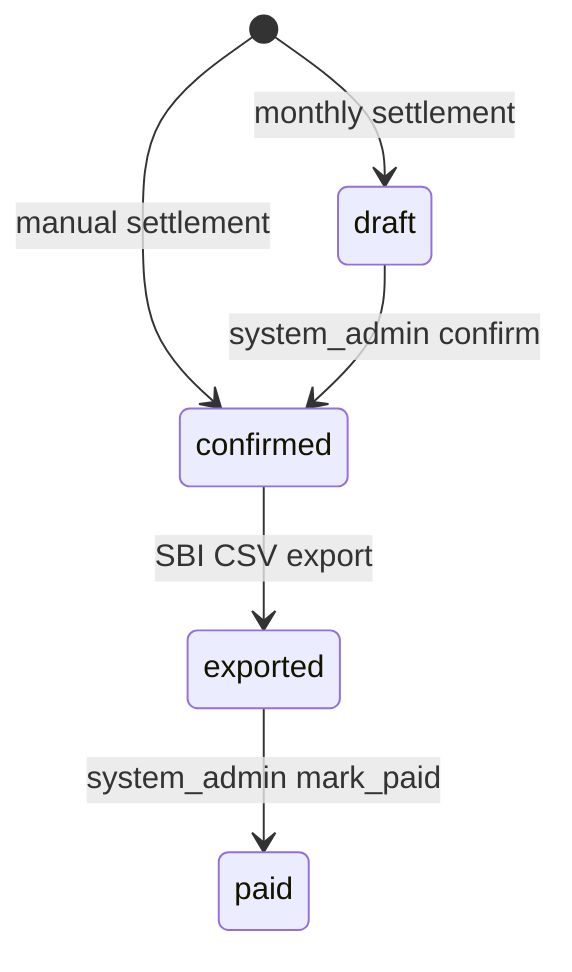

# Settlement Lifecycle

## 1. この文書の位置づけ

この文書は、精算作成、確定、振込CSV出力、支払済み化、支払明細書PDF、将来の銀行API振込対応を整理するための正本ドキュメントである。

現状把握では実コードを正として扱う。ただし、現在の実コードが今後も正しいという意味ではなく、実コードと既存ドキュメントの差分は後続Issueでどちらに寄せるかを決める。

この文書は以下の実コードを確認して作成している。

- `app/models/settlement.rb`
- `app/models/settlement_event.rb`
- `app/models/settlement_export.rb`
- `app/models/settlement_carryover.rb`
- `app/models/store_payout_account.rb`
- `app/models/store_ledger_entry.rb`
- `app/controllers/admin/settlements_controller.rb`
- `app/controllers/system_admin/settlements_controller.rb`
- `app/controllers/system_admin/settlement_exports_controller.rb`
- `app/services/settlements/monthly_generate_service.rb`
- `app/services/settlements/manual_preview_service.rb`
- `app/services/settlements/manual_create_service.rb`
- `app/services/settlements/month_period.rb`
- `app/services/settlements/sbi_furikomi_csv_export_service.rb`
- `app/services/payout_accounts/jp_bank_converter.rb`
- `config/routes.rb`
- `config/recurring.yml`
- `app/jobs/`

関連Issue:

- Epic: #925
- この文書追加: #926
- paid日時・操作者: #927
- confirmed以降の固定: #928
- 振込先スナップショット: #929
- CSV出力不整合: #930
- 手動精算: #931
- 月次精算導線: #932
- PDF生成方式: #933
- 支払明細書PDF: #934
- 将来API振込設計: #935

---

## 2. 現行ライフサイクル

現行実装の精算状態は以下である。

```text
draft / confirmed / exported / paid
```

現行実装の状態遷移は以下である。



現行実装では `confirmed -> paid` の直接遷移は提供していない。`SystemAdmin::SettlementsController#mark_paid` は `exported` の精算のみを対象にしている。

---

## 3. 状態の意味

### 3.1 draft

月次精算で作成される仮作成状態である。

現行実装では、`Settlements::MonthlyGenerateService` が `status: :draft` の `Settlement` を作成する。

### 3.2 confirmed

運営側で確定済みの状態である。

現行実装では以下の経路で作成または遷移する。

- 月次精算の `draft` を system_admin が `confirm` する
- 手動精算を `Settlements::ManualCreateService` が `confirmed` として作成する

CSV出力対象は `confirmed` のみである。

### 3.3 exported

振込CSVを生成済みの状態である。

`exported` は銀行振込成功を意味しない。現行実装では、住信SBIの総合振込CSVを生成し、`SettlementExport` とCSVファイルを保存し、対象 `Settlement` を `exported` に更新した状態である。

CSV出力時に、店舗の active な `manual_bank` 振込先を `Settlement` へスナップショット保存する。
このスナップショットは、`exported` 以降の支払・監査・支払明細書PDFで参照する振込先の正本であり、保存後は変更しない。

### 3.4 paid

正式な支払済み状態である。

支払明細書PDFの正式な対象は `paid` の精算のみとする。

現行実装では、system_admin が `exported` の精算詳細画面で「銀行アップロード/支払実行を確認した」にチェックし、`mark_paid` を実行すると `paid` になる。

現行スキーマには `settlements.paid_at` / `settlements.paid_by_user_id` がない。支払日を正本として扱うには、後続Issue #927 で追加する。

---

## 4. 売上集計と金額

### 4.1 売上集計の正

売上集計の正は `StoreLedgerEntry` である。

`StoreLedgerEntry` は `DrinkOrder` が `consumed` になった時点で作成される。未消化の `pending` ドリンクや返却済みの `refunded` ドリンクは `StoreLedgerEntry` を作らないため、精算集計には含めない。

集計基準日時は `StoreLedgerEntry.occurred_at` である。

### 4.2 月次精算

月次精算は `Settlements::MonthlyGenerateService` が処理する。

現行実装の主なルール:

- 対象期間はJST基準の前月
- `StoreLedgerEntry.occurred_at` を基準に集計する
- 既存 `Settlement` と重複する期間は除外する
- 店舗取り分は `gross_yen * 0.7` の floor
- `platform_fee_yen` は `gross_yen - store_share_yen`
- 最低支払額は10,000円
- 支払可能額が10,000円未満の場合、`Settlement` は作らず `SettlementCarryover` に繰り越す
- 繰越がある場合、次回支払可能時の最初の `Settlement` に加算し、相殺用の負の `SettlementCarryover` を作成する

### 4.3 手動精算

手動精算は `Settlements::ManualCreateService` が処理し、作成時点で `confirmed` になる。

現行実装では `ManualPreviewService` が繰越額を表示する一方、`ManualCreateService` は繰越額を `store_share_yen` に反映していない。この差分は後続Issue #931 で、手動精算の用途とあわせて整理する。

---

## 5. 振込先スナップショット

店舗振込先は `StorePayoutAccount` に保存される。

現行実装では、振込先スナップショットは `confirmed` 時点ではなく、CSV出力によって `exported` になる時点で `Settlement` に保存される。
今回の見直しでは、現行CSV運用を前提に、`exported` 時点のスナップショットを正本として扱う。
`exported` 以降の `Settlement` では、以下のスナップショットカラムを変更不可にする。

スナップショット対象の主なカラム:

- `payout_bank_code`
- `payout_branch_code`
- `payout_account_type`
- `payout_account_number`
- `payout_account_holder_kana`

支払明細書PDFや運営側の監査表示では、現在の `StorePayoutAccount` ではなく `Settlement` 側のスナップショットを参照する。

`StorePayoutAccount` が後から変更されても、過去に `exported` になった `Settlement` の振込先スナップショットは変わらない。

---

## 6. CSV出力

CSV出力は `Settlements::SbiFurikomiCsvExportService` が処理する。

現行実装の主なルール:

- 対象は `confirmed` の `Settlement` のみ
- 店舗に active な `manual_bank` の `StorePayoutAccount` が必要
- 1ファイル最大9,999件を上限として扱う
- CSV生成後に `SettlementExport` を作成し、CSVファイルをActiveStorageに添付する
- 対象 `Settlement` を `exported` に更新する
- 対象 `Settlement` に振込先スナップショットを保存する
- `SettlementEvent.exported` を記録する

確認済みの既存不整合:

- `SystemAdmin::SettlementExportsController#create` は、Serviceに必須の `settlements:` を渡していない
- 画面文言には9,999件超過時の分割が示されているが、実装は超過時にエラーとして扱う
- 当座口座 `current` のCSV口座種別変換に不整合がある可能性がある
- CSV失敗時に `SettlementEvent.export_failed` が記録されていない

これらは後続Issue #930 で修正する。

---

## 7. 支払済み化

現行実装では、`paid` への遷移は `SystemAdmin::SettlementsController#mark_paid` が行う。

主なルール:

- 対象は `exported` の `Settlement` のみ
- system_admin が確認チェックを入れた場合のみ実行する
- `Settlement.status` を `paid` に更新する
- `SettlementEvent.marked_paid` を記録する

現行実装には以下がない。

- `paid_at`
- `paid_by_user_id`
- `paid_source`
- paid後の取消・再精算の仕組み

`paid_at` は `paid` 精算では必須にする方向で後続Issue #927 で扱う。`paid_by_user_id` は手動 `mark_paid` では保存するが、将来の銀行API結果による自動 paid 化では nil または system user 扱いを許容する余地を残す。

---

## 8. 支払明細書PDF

支払明細書PDFは、精算ライフサイクルの出口として扱う。

正式な支払明細書PDFの対象は `paid` の `Settlement` のみとする。

想定する出力:

- 店舗管理者向け: 支払明細書
- system_admin向け: 支払明細書（運営控え）

PDFで参照する正本データ:

- 金額: `Settlement` の金額カラム
- 対象期間: `Settlement.period_from` / `Settlement.period_to`
- 支払日: 将来追加する `Settlement.paid_at`
- 振込先: `Settlement` の振込先スナップショット

PDF生成方式は後続Issue #933 で選定し、実装は #934 で扱う。

---

## 9. 将来の銀行API振込

SBI APIの詳細は銀行からの回答待ちであるため、このEpicではAPI実装そのものは対象外とする。API振込は将来設計ドキュメントまでに留める。

将来の銀行API振込では、`Settlement.status` に銀行処理状態を詰め込まない。

銀行への依頼、受付、成功、失敗、再試行、外部ID、結果コードなどは、精算支払いに限定した別モデルで管理する方針を検討する。

候補モデル:

- `SettlementPayoutBatch`
- `SettlementPayoutItem`

この設計は後続Issue #935 で扱う。

---

## 10. 既存ドキュメントとの差分

現行実装と既存ドキュメントの主な差分は以下である。

| 項目 | 既存ドキュメント | 現行実コード | 方針 |
| --- | --- | --- | --- |
| `confirmed -> paid` | 記載あり | 実装なし。`mark_paid` は `exported` のみ | 現行実装を正として扱い、必要なら後続Issueで仕様判断する |
| confirmed以降の固定 | 金額・振込先情報を固定すると記載 | 金額・期間はモデル上で変更不可。振込先情報は #929 で整理する | #928 / #929 で整理する |
| 振込先スナップショット | confirmed時点と読める記述あり | CSV出力時、`exported` 時点で保存。`exported` 以降は変更不可 | #929 で `exported` 時点の正本として明確化する |
| 支払日 | 未整理 | `paid_at` なし | #927 で追加する |
| API振込 | 未整理 | 未実装 | #935 で設計する |

---

## 11. 守る前提

- 金銭処理・状態変更は Service に集約する
- Controller は認可、Service 呼び出し、レスポンスに留める
- DB transaction は Service 側で扱う
- 売上集計の正は `StoreLedgerEntry`
- 未消化・返却済みドリンクを売上に含めない
- `paid` を正式な支払済み状態として扱う
- `exported` を銀行振込成功とは扱わない
