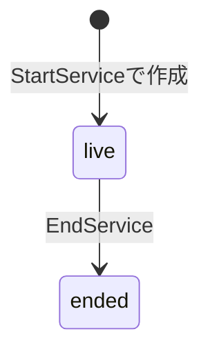
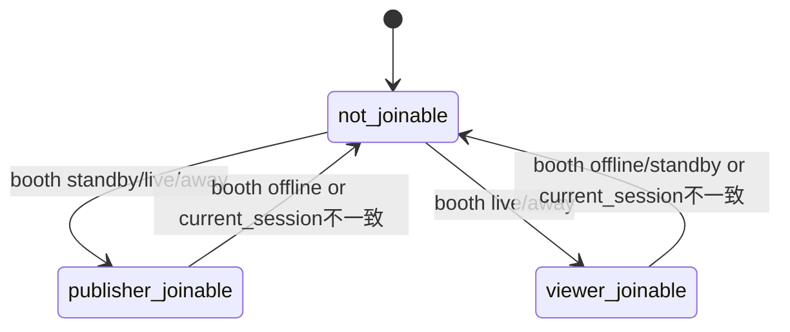
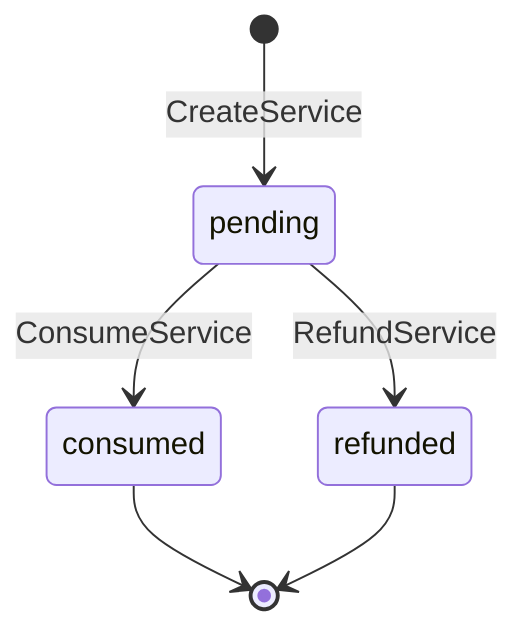
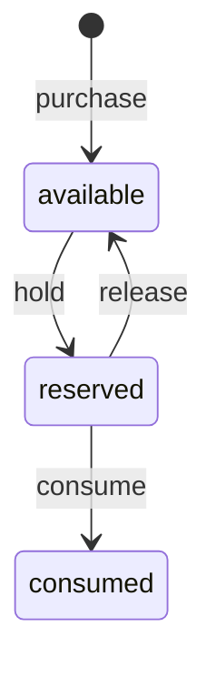
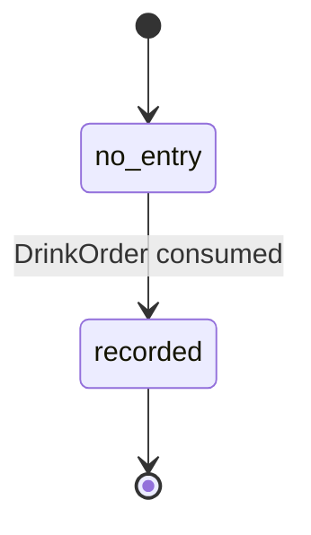
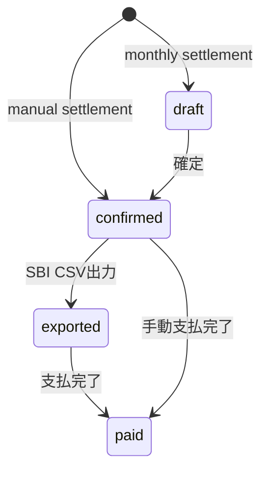
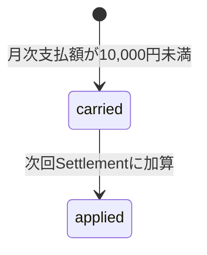

# State Transitions（現行実装確定版）

## 1. Booth 状態

```text
offline / standby / live / away
```

```mermaid
stateDiagram-v2
  [*] --> offline
  offline --> standby: StreamSessions::StartService
  standby --> live: StreamSessions::StatusService(to: live)
  live --> away: StreamSessions::StatusService(to: away)
  away --> live: StreamSessions::StatusService(to: live)
  live --> offline: StreamSessions::EndService
  away --> offline: StreamSessions::EndService
  standby --> offline: StreamSessions::EndService
```

補足:

- 配信開始直後、Booth は standby になる
- publisher は standby でも参加可能
- viewer は live / away のみ参加可能
- last_online_at は live / away 遷移時に更新される

---

## 2. StreamSession 状態

現行実装では、StreamSession は配信開始時に status: live で作成される。
終了時に status: ended になる。



補足:

- started_at はセッション作成時に記録
- ended_at は終了時に記録
- broadcast_started_at は実配信開始時刻として別途利用される
- 参加可否は StreamSession.status より Booth.status と current_stream_session_id を主に参照する

---

## 3. IVS参加状態



---

## 4. DrinkOrder 状態

```text
pending / consumed / refunded
```



確定ルール:

- 作成時は pending
- consumed になると売上確定
- refunded は pending のみ対象
- consumed 後の refund は現行実装では行わない
- 消化は FIFO 順

---

## 5. Wallet ポイント状態



実装上の意味:

- purchase: available_points 増加
- hold: available_points 減少、reserved_points 増加
- consume: reserved_points 減少
- release: reserved_points 減少、available_points 増加

WalletTransaction は履歴として以下を持つ。

```text
purchase / hold / release / consume / adjustment
```

---

## 6. StoreLedgerEntry



- DrinkOrder consumed 時に作成
- 精算集計の根拠
- occurred_at が集計基準

---

## 7. Settlement 状態

```text
draft / confirmed / exported / paid
```



補足:

- monthly は draft で作成
- manual は confirmed で作成
- CSV出力対象は confirmed のみ
- CSV出力後は exported
- 店舗画面には confirmed / exported / paid のみ表示

---

## 8. SettlementCarryover



- 10,000円未満の場合、Settlementは作成しない
- 繰越は SettlementCarryover に記録する
- 次回支払可能時に相殺用のマイナス繰越を作成する
