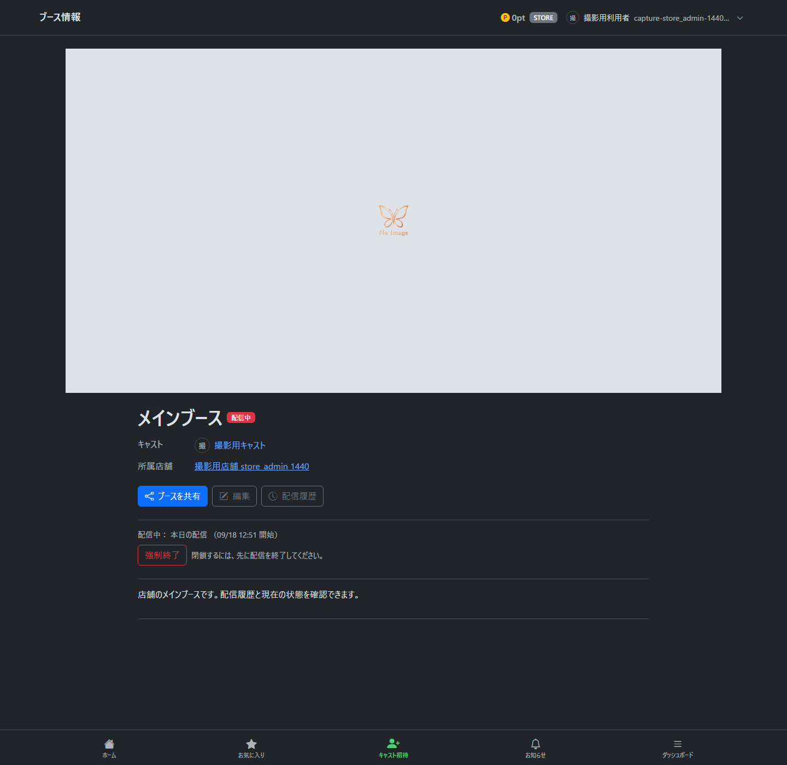
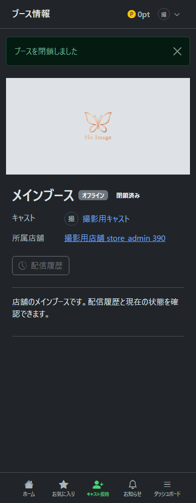
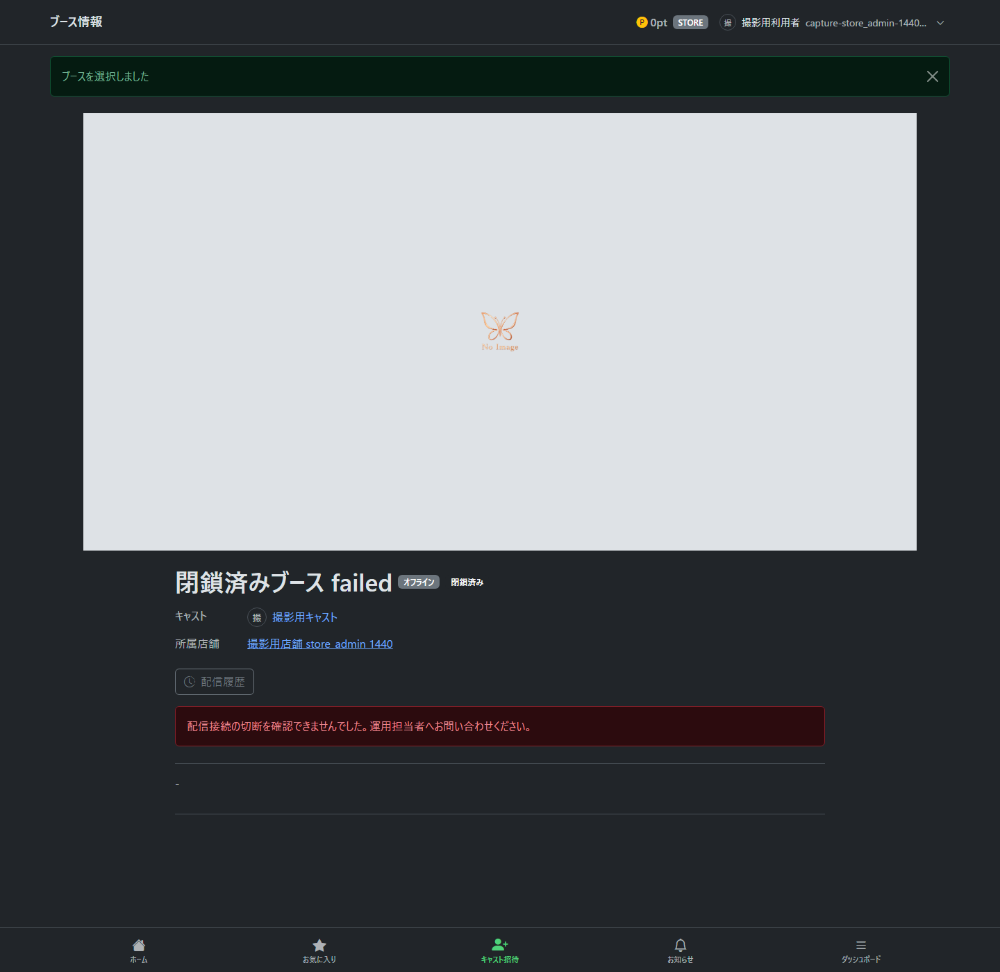
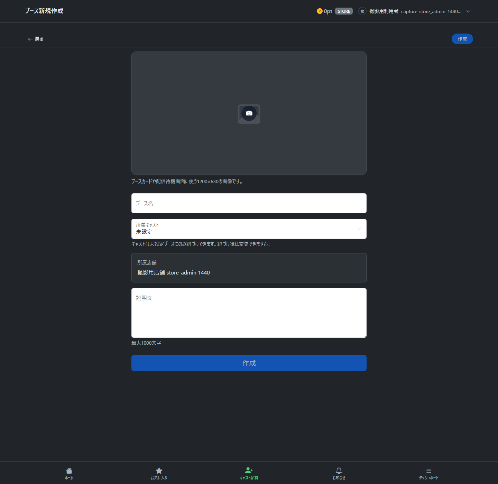

# ブース情報・新規作成・閉鎖の操作

2026-09-18の#1291〜#1293を反映した手順です。画像は架空データを使った専用テスト環境で撮影しています。[撮影・検証範囲](booth_management_capture.md)と[環境別の未確認事項](../design/booth_management_validation.md)を参照してください。

## 管理するブースを開く

1. ヘッダーの自分の名前・アイコンを押し、ブース名から対象を選びます。
2. ダッシュボードの「ブース情報」を開きます。
3. 店舗名・ブース名・配信状態を確認します。共有・編集・配信履歴もこの画面から開きます。

管理用の独立したブース一覧はありません。選択済みブースを変える入口はヘッダーです。未選択で情報へ進む場合は同じ選択モーダルを使います。候補0件・1件固定・本人配信中／離席中の固定ではモーダルは表示しません。詳しくは[選択の共通操作](current_selection_manual.md)を参照してください。

## 強制終了する

店舗管理者は管理する店舗、システム管理者は全店舗のブースを操作できます。一般キャストには管理ボタンを表示しません。

1. 配信中・離席中の「強制終了」を押します。
2. 確認に表示される店舗・ブース・配信タイトルを確認します。キャンセルすると終了しません。
3. 確定すると配信を終了し、未消化ドリンクを返却します。同じブース情報へ戻ります。

配信者側は終了通知を受信すると映像・音声の送信を止め、リザルトへ進みます。接続切断の結果は終了・返却とは別に表示します。古い画面からの操作で「状態が更新されています」と表示された場合は、画面を読み込み直して対象を確認してください。

## 閉鎖する

1. オフラインの「閉鎖」を押します。準備中の場合は、その準備を終了することも確認に表示されます。
2. 店舗・ブースを確認して確定します。配信中・離席中の場合は先に配信を終了してください。
3. 同じ情報画面に「閉鎖済み」と表示されます。閉鎖後も配信履歴は残ります。

閉鎖後は共有・編集・配信準備・配信開始ができません。管理者はヘッダーから閉鎖済みも選べます。閉鎖解除の操作はありません。

## 履歴と切断結果を確認する

閉鎖済みでも「配信履歴」から過去の配信を確認できます。「ブース情報へ戻る」で同じ対象へ戻ります。履歴0件でも同様です。キャストも担当の閉鎖済み情報・履歴のURLを閲覧できますが、ヘッダーの候補には出ず、選択状態もその閉鎖済みへ変更しません。

管理者に表示する接続の案内は次のとおりです。閲覧・再読込で切断処理をやり直すことはありません。

| 表示 | 対応 |
| --- | --- |
| 警告なし | 保存済み記録に未確認の切断はありません |
| 自動再試行中 | 結果を待ちます。初回に加えて最大3回の切断を試みます |
| 切断結果をまだ確認できない・再読込の案内 | 画面での結果取得が終わりました。最新の結果は再読込して確認します。AWS切断の最終失敗と同じ意味ではありません |
| 自動再試行に失敗・運用担当者へ問い合わせる案内 | 運用担当者へ連絡します。終了・返却が完了した配信を取り消す表示ではありません |

「再確認」「接続の切断を再試行」ボタンはありません。切断未確認でも情報・履歴は閲覧できますが、同じ人物・ブースの次回配信は保留します。運用担当者は[復旧手順](../ops/publisher_retry_recovery.md)を使います。

## 新しいブースを作る

1. ダッシュボードの独立した「ブース新規作成」を押します。店舗未選択なら共通モーダルで選びます。
2. 所属店舗を確認し、名前・説明・必要に応じて画像と所属キャストを設定します。キャストは未設定でも作成できますが、紐づけ確定後に変更できません。
3. 「作成」を押すとダッシュボードへ戻ります。「戻る」も同じ移動先です。
4. 新しいブースを管理する場合は、ヘッダーから選んで「ブース情報」を開きます。

既存の有効な選択は、作成だけでは変わりません。初めて候補が1件になった場合などの自動設定は共通ルールに従います。ブース0件・全件閉鎖でも、管理可能な店舗があれば作成できます。本人配信中・離席中のブース・店舗固定も維持します。
