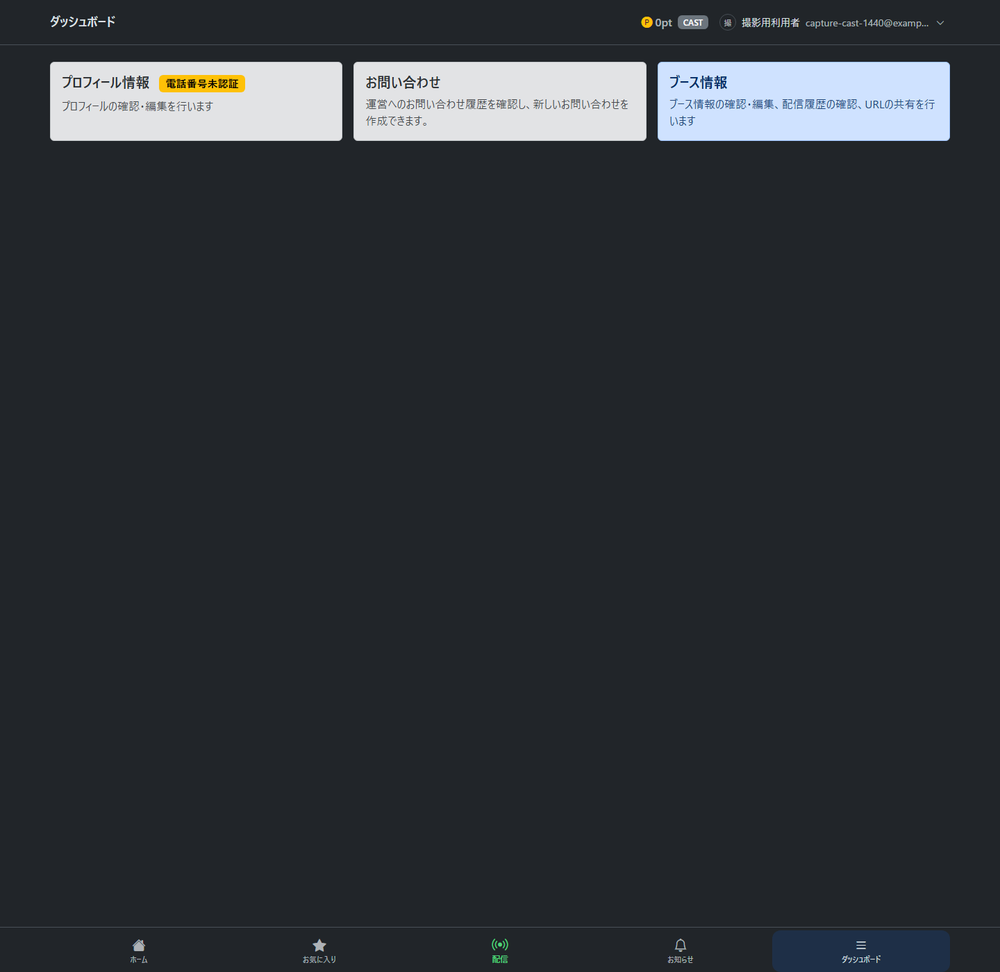
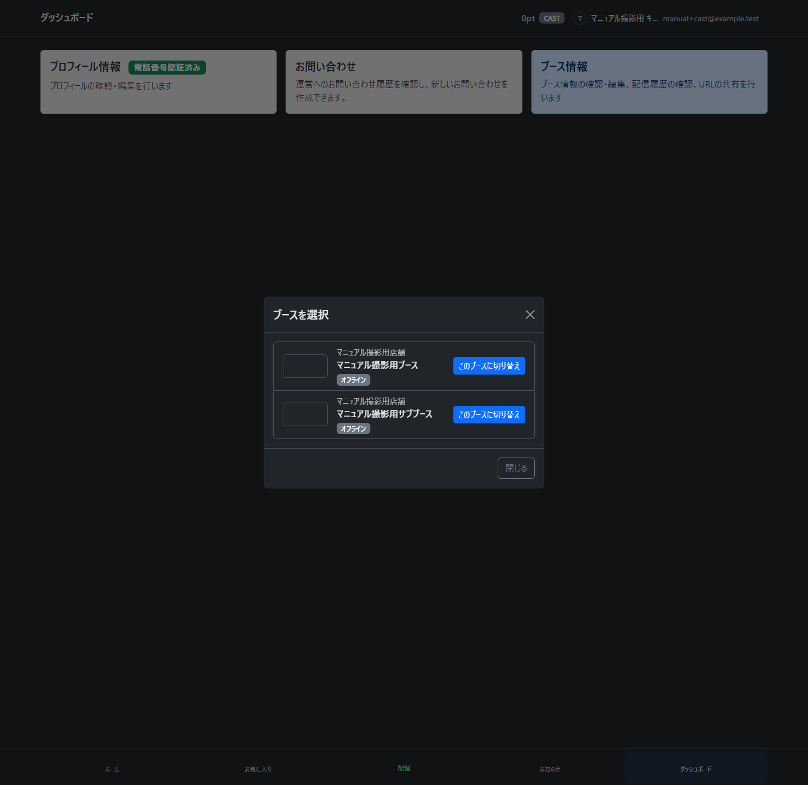
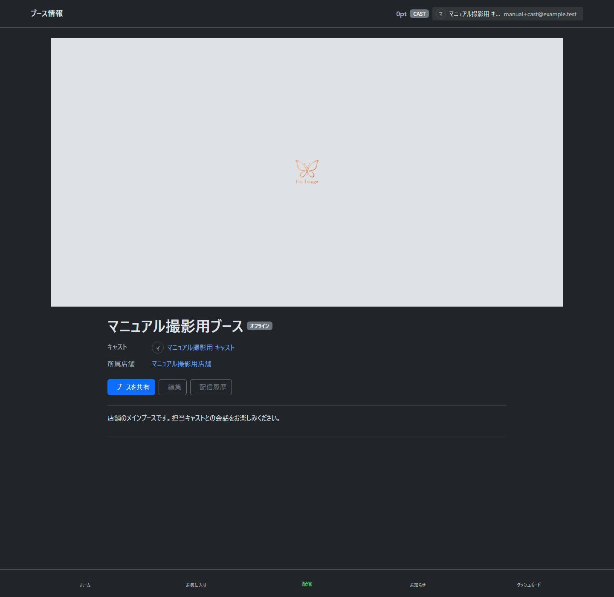
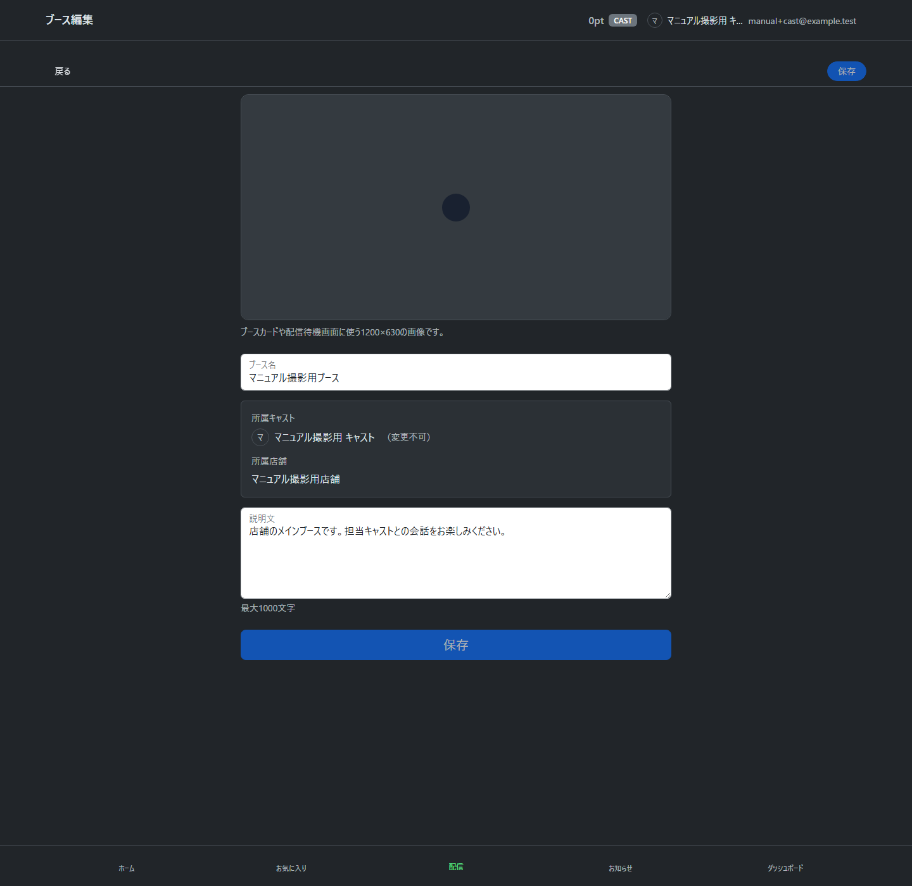
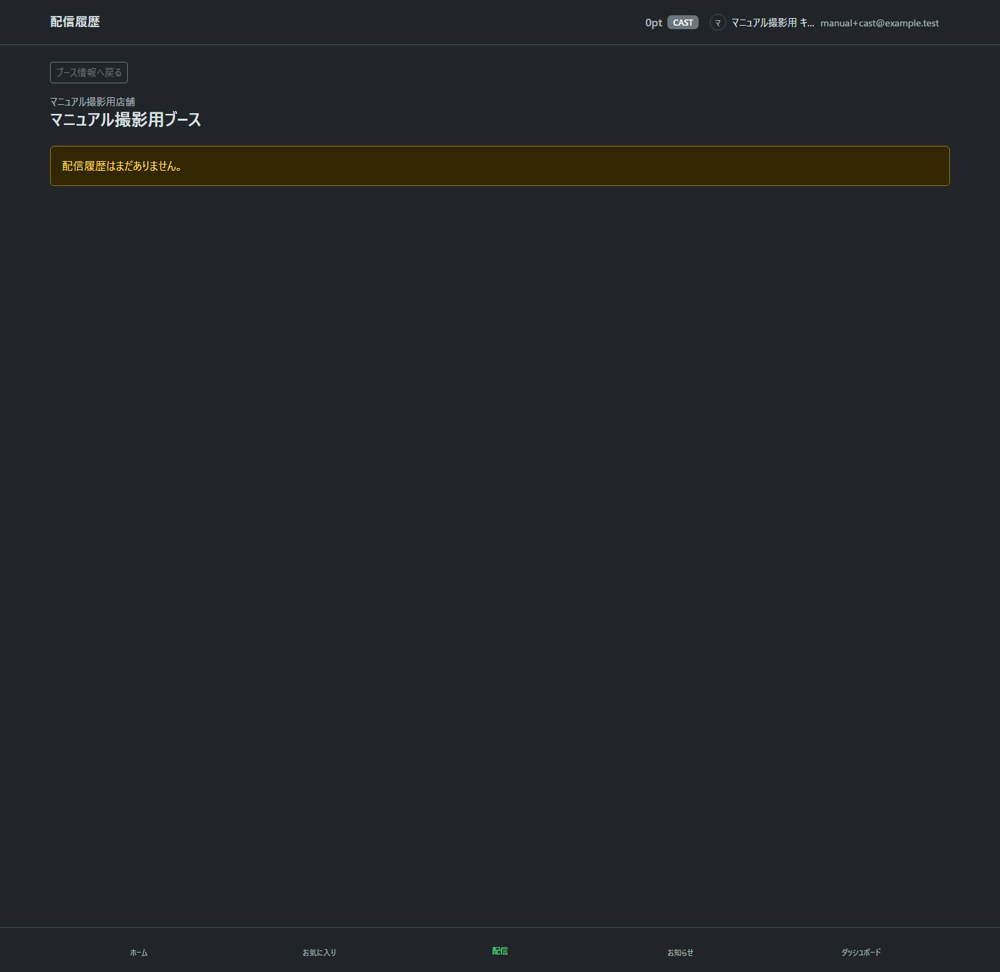

# cast（配信者）向け操作マニュアル ドラフト

この章では、cast（配信者）がログイン後に行う基本操作を説明します。アカウント作成は「アカウント作成」章の cast invitation（配信者招待）を参照してください。

※2026-09-16の選択改修を反映したローカル版です。環境への反映状況は[選択改修の記録](../ops/current_selection_staging_verification.md)を参照してください。[撮影範囲と未更新画像](selection_capture.md)を参照してください。

2026-09-18：ダッシュボード画像を更新しました。ブース情報・強制終了・閉鎖・閉鎖済み履歴・新規作成は[共通の管理手順](booth_management_manual.md)を参照してください。一般キャストには強制終了・閉鎖・新規作成を表示しません。画像の取得条件は[管理統合の撮影記録](booth_management_capture.md)に記載しています。

## dashboard（ダッシュボード）を確認する

ログイン後、dashboard（ダッシュボード）には cast（配信者）が使う画面へのカードが表示されます。

主なカードは次のとおりです。

- 「プロフィール情報」: 自分のプロフィール詳細を確認し、「プロフィールを編集」から表示名や自己紹介を編集できます。
- 電話番号の登録・認証は「プロフィール編集」のアカウント欄で行います。「プロフィール情報」カードのバッジで認証状態を確認できます。
- 「ブース情報」: ブースの確認・編集、配信履歴の確認、URLの共有を行います。

## 操作するブースを選ぶ

1. ヘッダー右側の自分の名前・アイコンでメニューを開き、ブース名（未選択なら「未選択」）を押します。
2. 操作するブースの「このブースに切り替え」を押します。所属店舗も同時に切り替わります。
3. ブース情報・編集・配信履歴を開いている場合は、選んだブースの画面へ切り替わります。

ブースが1件なら自動選択され、選択モーダルは出ません。本人が配信中・離席中なら配信中のブースに固定され、切り替えるには先に配信を終了します。複数候補で未選択の場合は「ブース情報」や「配信」へ進むと選択モーダルが開きます。候補がない場合は案内だけを表示します。

切替時の確認・失敗時の扱いは[ブース・店舗選択の共通操作](current_selection_manual.md)を参照してください。旧「ブース一覧」画面はダッシュボードへ戻ります。

## booth（ブース）情報を確認する

1. dashboard（ダッシュボード）から「ブース情報」を開きます。
2. booth（ブース）の名前、所属店舗、担当 cast（配信者）を確認します。
3. 必要に応じて、共有、編集、配信履歴へ進みます。

情報・編集・履歴は選択中のブースを対象とします。別ブースのURLを開いても自動では切り替わらないため、ヘッダーから選択してください。情報を確認するだけでは配信準備を開始しません。キャストは閉鎖済みブースを選択できません。

「ブースを共有」から booth（ブース）の URL を共有できます。

TODO: 共有ボタンの挙動はブラウザや端末によって異なるため、対応ブラウザ別の説明を追記します。

## booth（ブース）を編集する

1. dashboard（ダッシュボード）から「ブース情報」を開き、「編集」を押します。
2. 「ブース名」と「説明文」を確認します。
3. 必要な項目を入力します。
4. 「保存」を押します。

更新が完了すると編集したブースの情報画面へ戻り、「ブースを更新しました」と表示されます。「戻る」でも同じ情報画面へ戻れます。招待直後の初回設定は、保存後にホームへ進みます。

サムネ画像を設定できる場合があります。画像を変更する場合は、画面上のアップロード欄から画像を選択してください。

TODO: サムネ画像アップロードの具体的な操作と推奨画像サイズは、別途撮影して追記します。

## 配信画面の入口を開く

1. ヘッダーで対象ブースを選び、フッターの「配信」を押します。ホームで選択中の担当ブースのカードを開いても準備へ進めます。選択外のカードは視聴画面へ進み、選択は変わりません。
2. 配信準備画面が開きます。他の人が配信中・離席中、または店舗が非公開の場合は準備・開始できません。
3. 配信前の状態では、配信タイトル入力欄と「配信開始」ボタンが表示されます。

※この配信準備の画像は旧撮影です。今回の撮り直しは選択・情報・編集・履歴に限定し、実際の配信準備の画像は後日更新します。

この画面では、配信タイトルを設定できます。未入力の場合は booth（ブース）名が表示されます。

準備中にヘッダーから別ブースへ切り替えると、そのブースの準備画面へ移ります。切替先が他者配信中・閉鎖済み・非公開店舗なら情報画面で理由を案内します。元の保存済みタイトルと準備は残ります。

## 配信履歴を確認する

1. dashboard（ダッシュボード）から「ブース情報」を開き、「配信履歴」を押します。
2. 開いた情報画面の booth（ブース）の終了済み配信が一覧表示されます。「ブース情報へ戻る」で同じブースの情報画面へ戻れます。
3. 履歴がない場合は、空状態のメッセージが表示されます。

TODO: 終了済み配信がある場合の一覧表示と配信リザルト画面は別途撮影して追記します。

## pending drink orders（未消化ドリンク）を確認する

配信画面では、customer（視聴者）から送られた drink order（ドリンク注文）を確認し、必要に応じて消化します。

以下は過去の撮影による未消化ドリンクがない状態です。今回、実配信・ドリンク操作の画像は撮り直していません。

TODO: customer（視聴者）によるドリンク送信、cast（配信者）による消化、返却処理は別途撮影して追記します。

## 配信開始・席外し・復帰・終了

以下は#1280の新方式を有効化した環境での操作です。実環境への適用状況は[有効化記録](../ops/actual_publisher_rollout.md)を確認してください。実機のカメラ・マイク・画面加工を含む画像は未撮影です。

1. 配信準備を開き、カメラ・マイクの使用を許可して「配信開始」を押します。他の権限者が作った準備でも利用できます。配信に成功した本人が実績に記録されます。
2. 開始結果を確認できない場合は「再確認」を押します。開始途中なら「開始を取り消す」で同じ準備へ戻れます。他の人が配信中の場合は開始できません。
3. 配信中は席外し・復帰を操作できます。画面を再読込した場合も、本人が同じ配信へ戻ります。配信者と初回開始時刻は変わりません。
4. ドリンクは配信中・離席中の本人が先頭から消化します。店舗管理者・システム管理者も、他の人の配信の代理消化はできません。
5. 配信終了後はリザルトに進み、未消化分は返却されます。履歴・共有・個人別実績には、その配信を行った本人が表示されます。
6. 終了後に接続の切断待ちが表示された場合、リザルトの再確認を使います。返却の操作をやり直す必要はありません。接続が解消するまで同じ本人・ブースの次の開始は待機します。

ブース情報の担当者表示と、各配信の配信者表示は別です。旧履歴は対象条件に該当するものだけ準備作成者の実績として補完し、開始記録がない等の対象外は「配信者不明」と表示します。

## 困ったとき

ブース未選択、候補なし、配信中の固定、権限変更や通信エラーは[共通操作の「困ったとき」](current_selection_manual.md#困ったとき)を参照してください。

以下の媒体・画面加工の案内と画像は未整備です。

- カメラ / マイクが許可されていない。
- Banuba / DeepAR（画面加工）の token / license が未設定。
