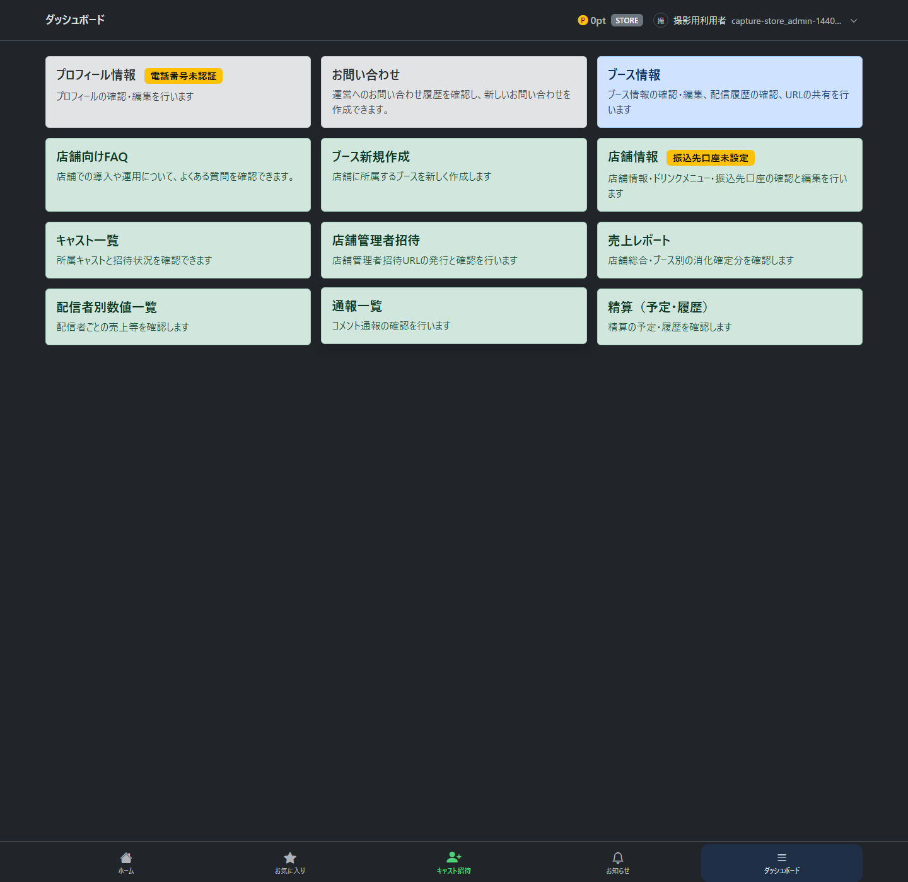
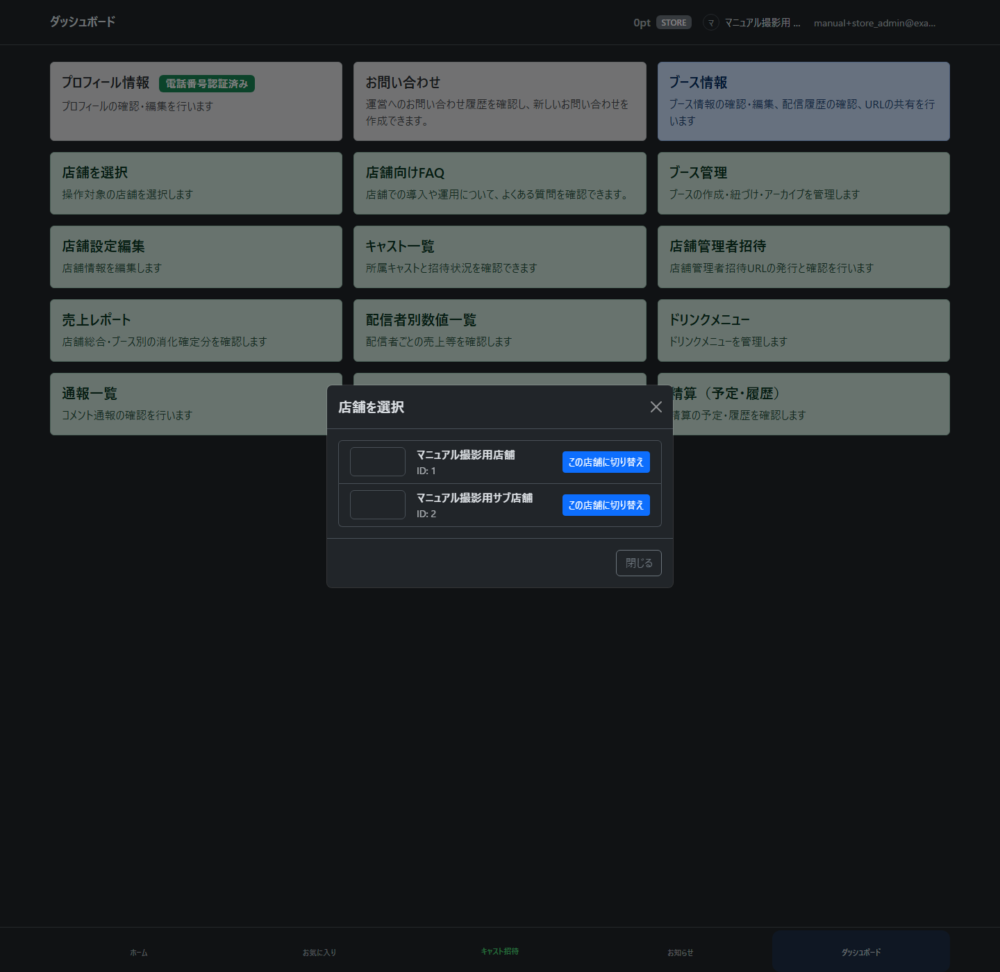
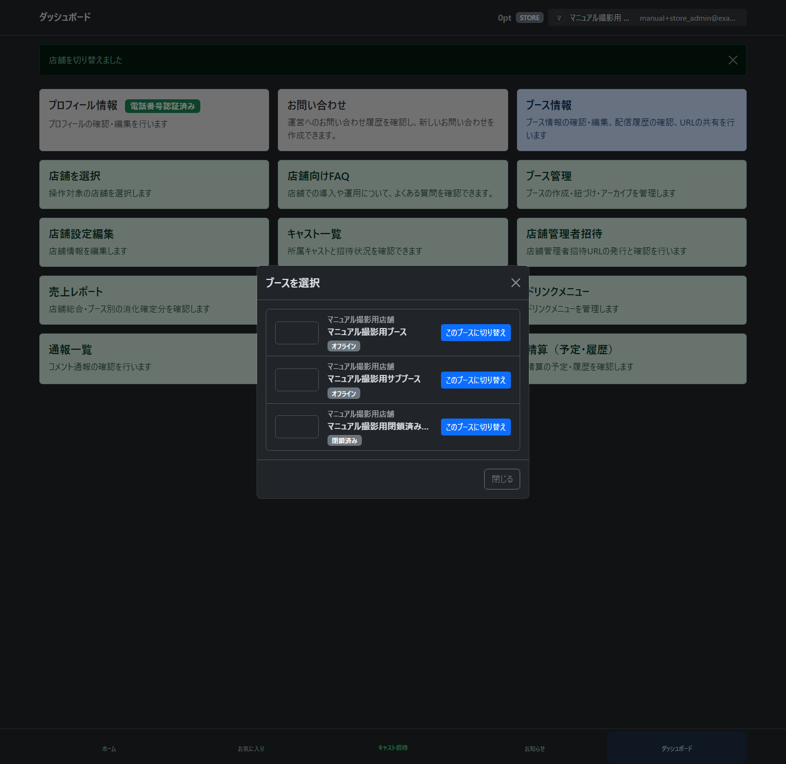

# store_admin（店舗管理者）向け操作マニュアル ドラフト

※2026-09-18の店舗情報・編集導線を本文に反映しました。店舗情報・編集・口座の既存画像は旧仕様です。ダッシュボードとブース管理の画像は#1294で更新しました。今回の確認は別の専用テストDBで行い、マニュアル全体の撮影用データを更新しないため一括再撮影は未実施です。

※2026-09-16の選択改修を反映したローカル版です。`selection/`と`booth_management/`以外の画像は過去の撮影を保持しています。対象外の編集・管理操作は今回再撮影しておらず、現在のヘッダーとは異なる場合があります。[撮影範囲と未更新画像](selection_capture.md)を参照してください。

この章では、store_admin（店舗管理者）が店舗・ブース・キャスト・ドリンクメニュー・精算関連情報を確認、管理する手順を説明します。

TODO: 公開マニュアルでは、各店舗の運用ルールに合わせて「誰がどの操作を行うか」を追記してください。

## dashboard（ダッシュボード）を確認する

ログイン後、dashboard（ダッシュボード）では店舗管理に必要な画面へのカードが表示されます。

主なカード:

- 店舗を選択
- ブース情報・ブース新規作成
- 店舗情報（店舗基本情報・ドリンクメニュー・振込先口座）
- キャスト一覧
- 店舗管理者招待
- 配信者別数値一覧
- 通報一覧
- 精算（予定・履歴）

「店舗を選択」は店舗を手動で変更できる場合に表示されます。1店舗だけの場合や、本人が配信中・離席中の場合は表示されません。

## 操作する店舗・ブースを選ぶ

1. 店舗を変更する場合は、ヘッダー右側の自分の名前・アイコンでメニューを開き、店舗名から選択モーダルを開き、対象の店舗を選びます。「店舗を選択」カードも同じモーダルを開きます。
2. ブースを変更する場合は、ヘッダーのブース名から選択モーダルを開き、対象のブースを選びます。所属店舗も同時に切り替わります。
3. ブース情報・編集・履歴など、選択に対応する画面は新しい対象へ切り替わります。公開詳細や個別の配信結果を見ている場合は、表示対象を維持します。

管理する全店舗が選択対象です。ブース候補は選択中の店舗だけに限定されず、閉鎖済みも含みます。候補が1件なら自動設定されます。本人が配信中・離席中の場合は、そのブース・店舗に固定され、店舗選択カードも表示されません。

ホームでは、選択中の操作可能なブースのカードを開くと「視聴／配信」を選べます。選択外のカードは直接視聴へ進み、選択は変わりません。他者配信中・離席中、閉鎖済み、非公開店舗のブースは配信準備・開始できません。

詳しくは[ブース・店舗選択の共通操作](current_selection_manual.md)を参照してください。店舗変更後のブース未設定、未保存確認、切替失敗時の対応も記載しています。

2026-09-18：ダッシュボード画像を更新しました。ブース情報・強制終了・閉鎖・閉鎖済み履歴・新規作成は[共通の管理手順](booth_management_manual.md)を参照してください。一般キャストには強制終了・閉鎖・新規作成を表示しません。画像の取得条件は[管理統合の撮影記録](booth_management_capture.md)に記載しています。

## 店舗情報を編集する

店舗名、概要、地域、業態、電話番号、営業時間、各種 URL などを編集できます。

1. ダッシュボードから「店舗情報」を開き、「店舗情報を編集」を押します。管理用の店舗情報では基本情報・ドリンク・伏字の振込先口座を確認できます。公開店舗ページには編集リンクはありません。
2. 必要な項目を入力します。

3. 「保存」を押します。
4. 更新が完了すると同じ店舗の「店舗情報」へ戻ります。保存せず「戻る」を押す場合も同じ画面へ戻ります。未保存変更があれば破棄確認が表示されます。

TODO: 住所を保存すると座標取得が走る実装です。公開マニュアルでは、住所入力の扱いと外部地図連携の有無を確認してから説明してください。

## ブースを管理する

対象の変更はヘッダーから行い、ダッシュボードの「ブース情報」を開きます。共有・編集・履歴と、状態に応じた強制終了・閉鎖をここから行います。閉鎖済みは履歴のみ利用でき、必要に応じて切断状態やエラーを表示します。管理用の独立した一覧はありません。

### ブースを作成する

1. ダッシュボードの「ブース新規作成」を押します。店舗が未選択なら共通モーダルで選びます。
2. 「所属店舗」を確認し、ブース名・説明・必要に応じて画像と所属キャストを設定します。キャスト未設定でも作成できます。紐づけ確定後の変更はできません。
3. 「作成」を押すとダッシュボードへ戻ります。「戻る」も同じ移動先です。
4. 作成したブースを操作する場合は、必要に応じてヘッダーで選び、「ブース情報」を開きます。作成によって既存の有効な選択を上書きしません。

ブース0件・全件閉鎖でも、管理可能な店舗があれば作成できます。本人配信中・離席中のブースと店舗の固定は維持します。候補が初めて1件になるなど共通の自動設定は行います。詳しくは[共通操作](current_selection_manual.md)を参照してください。

## キャスト一覧を確認する

キャスト一覧では、店舗に所属している cast（配信者）と所属ブースを確認できます。

注意:

- 「削除」は cast（配信者）の所属解除です。関連ブースがアーカイブされる場合があります。
- この操作は取り消しや影響範囲を確認してから実行してください。

## キャストを招待する

1. フッターの「キャスト招待」を押します。対象店舗が未選択なら選択します（候補が1店舗の場合は自動選択）。
2. 開いたモーダルで、対象店舗名・招待URL・期限を確認します。URLは自動発行され、有効期限は1週間です。
3. 必要なら「管理者用メモ」を入力します。招待相手には表示されません。
4. 「招待URLを共有」を押して本人へ送ります。共有非対応の場合は「招待URLをコピー」となるので、LINEなどへ貼り付けて送ります。メモはこの操作時に保存されます。
5. 共有・コピー成功後は「閉じる」に切り替わります。メモを修正した場合は「閉じる」で変更を保存してから閉じます。保存失敗時は入力を残して再試行できます。

共有・コピー前の「キャンセル」は招待そのものを取り消し、URLを使えなくします。端末の共有画面だけをキャンセルした場合は、招待は有効なままです。

初回のチュートリアルは「フッターのキャスト招待 → モーダルで共有・コピー → 閉じる → ダッシュボード → ドリンク設定」と進みます。進捗・スキップは店舗単位です。

### キャスト招待一覧を確認する

ダッシュボードの「キャスト一覧」を開き、「キャスト招待一覧」タブを選びます。有効・使用済み・期限切れの招待を新しい順に表示します。確認できる項目は状態、管理者用メモ、発行日時、有効期限、発行者、承認者です。

一覧は閲覧専用です。URLや発行・再共有・コピー・取消・メモ編集の操作はありません。取消済みは表示しませんが、履歴データは保持されます。旧キャスト招待画面のURLはこのタブへ転送されます。

## 店舗管理者を招待する

store_admin invitation（店舗管理者招待）画面では、追加の store_admin（店舗管理者）を店舗へ招待する URL を発行できます。

1. 「招待 URL を発行」を押します。
2. 発行された URL を追加したい店舗管理者へ共有します。

TODO: 店舗管理者を追加できる条件と、退職・担当変更時の運用を追記してください。

## ドリンクメニューを管理する

ダッシュボードの「店舗情報」から「ドリンクメニューを編集」を開きます。作成・編集を保存すると店舗情報へ戻ります。編集キャンセルや有効／無効の切替はメニュー内に留まり、「店舗情報へ戻る」で戻れます。

ドリンクメニュー画面では、視聴者が送れるドリンクの名前、価格、表示順、有効 / 無効を管理できます。

### ドリンクを追加する

1. 新規作成フォームにドリンク名、価格、表示順を入力します。

2. 「新規作成」を押します。
3. 保存後、店舗情報へ戻り、新しいドリンクが表示されます。

注意:

- 価格はポイント単位です。
- 無効にしたドリンクは通常の注文対象から外れます。
- TODO: ドリンク編集と無効化の詳細な運用ルールを追記してください。

## 配信者別数値一覧を確認する

配信者別数値一覧では、cast（配信者）ごとの配信売上、配信時間、売上 / 時間などを確認できます。

配信実績がない cast（配信者）も含める場合は、「配信実績がない配信者も表示する」を使います。

TODO: 売上計算の対象は「消化確定済みドリンクのみ」という Phase1 前提を、精算章と合わせて説明してください。

## 通報一覧を確認する

通報一覧では、店舗の配信コメントに対する通報を確認できます。

注意:

- BAN、BAN解除、却下は影響の大きい操作です。
- TODO: 通報対応の判断基準、対応後のユーザーへの影響、運営へのエスカレーション条件を追記してください。

## 振込先口座を設定する

ダッシュボードの「店舗情報」から「振込先口座を編集」を開き、精算時の入金先を登録します。保存成功後・「戻る」は同じ店舗情報へ戻ります。未設定の場合は「店舗情報」カードに「振込先口座未設定」と表示されます。

1. 口座の種類を選択します。
2. 銀行コード、支店コード、預金種目、口座番号、口座名義カナを入力します。

3. 「更新する」を押します。
4. 更新後、登録済み口座は一部だけマスクされて表示されます。

注意:

- 実際の銀行口座情報は、必ず店舗が管理する正しい情報を入力してください。
- 画面上では既存口座番号の全桁は表示されません。
- TODO: 口座情報の確認フローと、変更できる担当者のルールを追記してください。

## 精算（予定・履歴）を確認する

精算画面では、次回精算予定の概算と、確定済み精算履歴を確認できます。

表示される情報:

- 集計期間
- 支払予定額
- 当月の消化 pt 合計
- 店舗取り分
- 前月からの繰越
- 精算履歴

注意:

- 表示金額は概算です。
- 精算は月次で行われます。
- 1万円未満は翌月へ繰り越されます。
- TODO: 確定済み精算の詳細画面と、振込予定日の説明を追記してください。
