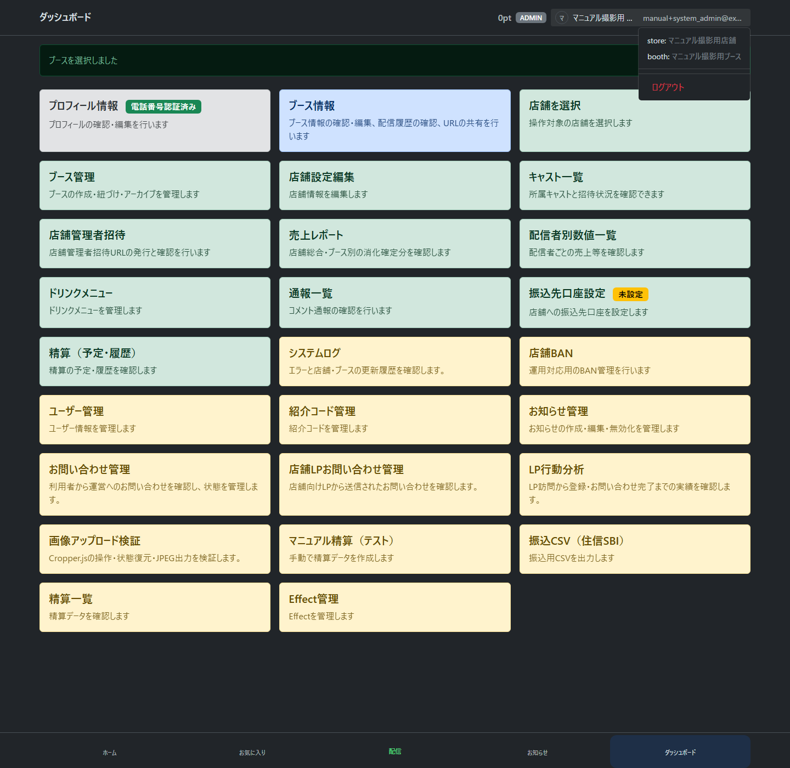
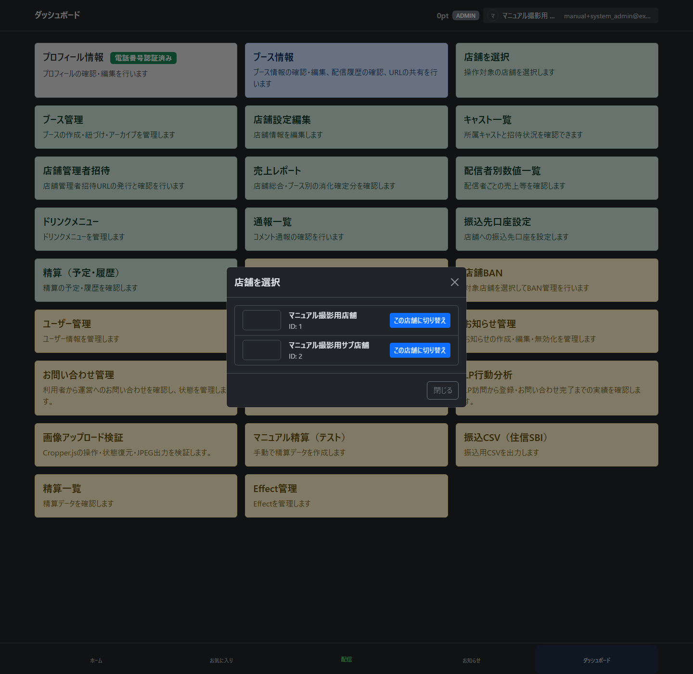
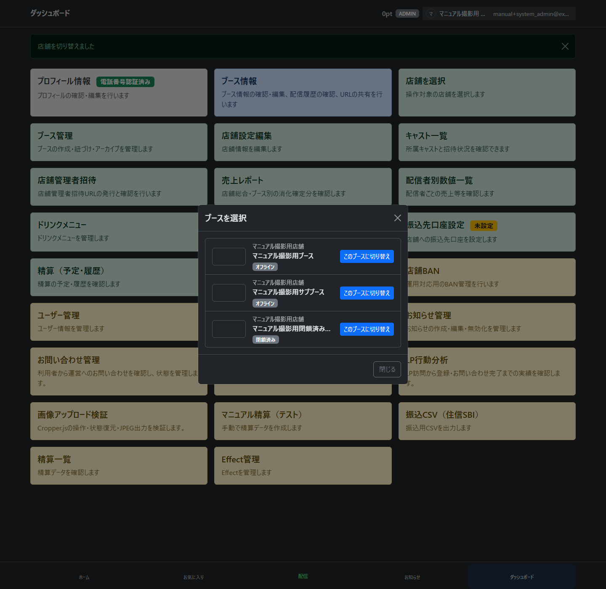

# system_admin（運営）向け操作マニュアルドラフト

※2026-09-16の選択改修を反映したローカル版です。`selection/`以外の画像は過去の撮影を保持しています。対象外の編集・管理操作は今回再撮影しておらず、現在のヘッダーとは異なる場合があります。[撮影範囲と未更新画像](selection_capture.md)を参照してください。

この章は、system_admin（運営）としてログインした後の通常操作を説明するためのドラフトです。画面名や遷移は実コードと Playwright（ブラウザ自動操作）で取得したスクリーンショットを根拠にしています。危険操作は今回実行していないため、該当箇所には TODO を残しています。

## ダッシュボードを確認する

system_admin（運営）でログインし、ダッシュボードを開きます。

ダッシュボードには、ユーザー管理、紹介コード管理、お知らせ管理、Effect 管理、店舗BAN、精算一覧、振込CSV、マニュアル精算などの入口が表示されます。

TODO: 実運用で system_admin（運営）アカウントを誰が発行し、どの手順で初期パスワードを渡すかは別途追記します。

## LP行動分析を確認する

ダッシュボードの「LP行動分析」を開くと、匿名訪問単位のRails保存実績を確認できます。この画面はsystem_admin（運営）だけが閲覧できます。

対象期間は「今日」「過去7日」「過去30日」「任意期間」から選びます。必要に応じてLP、流入元、`utm_source`、`utm_campaign`、`utm_content`、端末を指定して「絞り込む」を選びます。任意期間は開始日と終了日を含む最大366日です。

期間は日本時間の訪問開始日で判定します。たとえば前日にLPへ入り、翌日に店舗登録を完了した場合も、完了は訪問開始日の集計に含まれます。

画面では次を確認できます。

- KPI（LP訪問、CTAクリック訪問、フォーム到達、登録・お問い合わせ完了とCV率）
- 店舗登録・お問い合わせの連続ファネル
- スクロール・主要セクション到達率
- CTAごとの位置到達訪問、クリック訪問、総クリック、到達者CTR
- 最近のコンバージョン

「訪問詳細」を選ぶと、公開訪問ID、LP、流入・UTM、端末、最終到達地点、最終結果と、匿名イベントの時系列を確認できます。氏名、メールアドレス、電話番号、フォーム入力内容は表示・保存しません。実人数ではなく匿名訪問数である点と、CTAクリック訪問数と総クリック回数が別の指標である点に注意してください。

## 操作する店舗・ブースを選ぶ

1. 店舗を変更する場合は、ヘッダー右側の自分の名前・アイコンでメニューを開き、店舗名から選択モーダルを開き、対象の店舗を選びます。「店舗を選択」カードも同じモーダルを開きます。
2. ブースを変更する場合は、ヘッダーのブース名から選択モーダルを開き、対象のブースを選びます。所属店舗も同時に切り替わります。
3. ブース情報・編集・履歴など、選択に対応する画面は新しい対象へ切り替わります。公開詳細や個別の配信結果を見ている場合は、表示対象を維持します。

全店舗が選択対象です。ブース候補は選択中の店舗だけに限定されず、閉鎖済みも含みます。候補が1件なら自動設定されます。本人が配信中・離席中の場合は、そのブース・店舗に固定され、店舗選択カードも表示されません。

ホームでは、選択中の操作可能なブースのカードを開くと「視聴／配信」を選べます。選択外のカードは直接視聴へ進み、選択は変わりません。他者配信中・離席中、閉鎖済み、非公開店舗のブースは配信準備・開始できません。

詳しくは[ブース・店舗選択の共通操作](current_selection_manual.md)を参照してください。店舗変更後のブース未設定、未保存確認、切替失敗時の対応も記載しています。

※文書整備上の残作業：管理用店舗情報への集約は#1251〜#1253、旧ブース管理の撤去・新規作成カード・閉鎖済み情報画面の操作整理は#1291〜#1294で対応します。後続画面の完成を前提にした手順・画像は掲載しません。

## ユーザーを管理する

「ユーザー管理」を開くと、ユーザーの一覧を確認できます。

「新規作成」を選ぶと、ユーザー作成フォームが表示されます。

email（メールアドレス）、role（権限種別）、password（パスワード）、password_confirmation（パスワード確認）を入力します。

「作成する」を選ぶとユーザー一覧へ戻り、作成したユーザーが表示されます。

注意: 実コード上、store_admin（店舗管理者）はこの画面から作成・変更できません。store_admin（店舗管理者）は店舗登録または店舗管理者 invitation（招待）経由で作成します。

TODO: ユーザー停止、role（権限種別）変更、復元に関する運用基準を追記します。今回の撮影では停止や降格は実行していません。

## 紹介コードを管理する

「紹介コード管理」を開くと、ReferralCode（紹介コード）の一覧を確認できます。

「新規作成」を選ぶと、紹介コード作成フォームが表示されます。

code（コード）、label（識別用ラベル）、expires_at（有効期限）、enabled（有効）を入力します。

「作成する」を選ぶと紹介コード一覧へ戻り、作成したコードが表示されます。

TODO: 紹介コードの配布方法、期限切れ時の案内、無効化の運用基準を追記します。

## お知らせを管理する

「お知らせ管理」を開くと、お知らせの一覧を確認できます。

「新規作成」を選ぶと、お知らせ作成フォームが表示されます。

タイトル、本文、公開日時、enabled（有効）、タグを入力します。新規タグはカンマまたは改行区切りで追加できます。

「作成する」を選ぶとお知らせ一覧へ戻り、作成したお知らせが表示されます。

TODO: 公開前確認、非公開化、重要告知のタグ運用、実ユーザーへの通知タイミングを追記します。

## Effect を管理する

「Effect管理」を開くと、Effect（配信画面のエフェクト）の一覧を確認できます。

「新規作成」を選ぶと、Effect 作成フォームが表示されます。

表示名、key（一意キー）、zip_filename（配置済み zip ファイル名）、icon_path（アイコンパス）、position（表示順）、enabled（有効）を入力します。

「作成する」を選ぶと Effect 一覧へ戻り、作成した Effect が表示されます。

TODO: Banuba / DeepAR（画面加工）のファイル配置、ライセンス確認、配信画面での表示確認手順を追記します。

## 店舗BANを確認する

店舗を選択した状態で「店舗BAN」を開くと、対象店舗の BAN 管理画面が表示されます。

BAN対象と理由を入力できますが、今回の撮影では BAN 作成は実行していません。

TODO: BAN作成、BAN解除、通報起点の対応手順、解除判断の基準を追記します。実行前に運用責任者の確認が必要です。

## 精算一覧を確認する

「精算一覧」を開くと、settlement（精算）データを確認できます。

TODO: draft / confirmed / exported / paid の状態ごとの意味、確定、支払済み更新、取消に相当する運用を追記します。今回の撮影では確定・支払済み更新は実行していません。

## 振込 CSV を確認する

「振込CSV（住信SBI）」を開くと、settlement export（精算書き出し）の一覧を確認できます。

詳細を開くと、format（形式）、record count（件数）、total amount（金額合計）、生成者、生成日時を確認できます。

TODO: CSV生成、CSVダウンロード、銀行アップロード後の確認、支払済み更新の手順を追記します。今回の撮影では CSV ダウンロードと生成は実行していません。

## マニュアル精算をプレビューする

「マニュアル精算（テスト）」を開くと、手動で精算対象期間を指定するフォームが表示されます。

対象店舗、period_from（開始日時）、period_to（終了日時）を入力します。

「プレビュー」を選ぶと、gross_yen（総額）、store_share_yen（店舗取り分）、platform_fee_yen（手数料）が表示されます。マニュアル精算（テスト）では繰越額を適用しません。

TODO: 「確定（confirmedで作成）」を押す前の承認フロー、作成後の修正可否、重複期間の扱いを追記します。今回の撮影では確定作成は実行していません。
